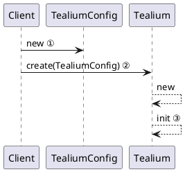
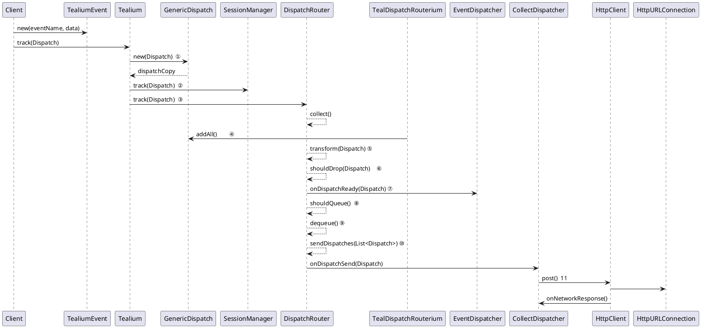
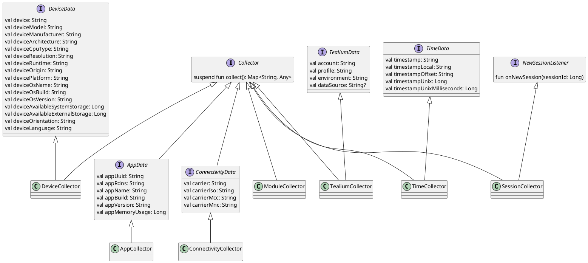
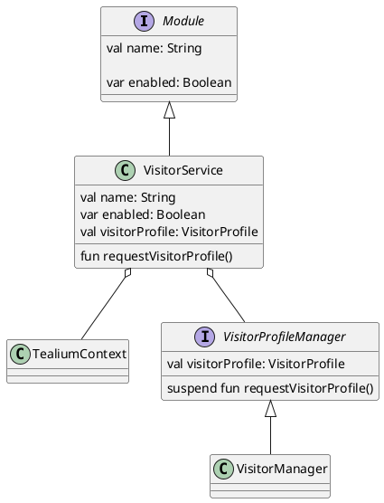
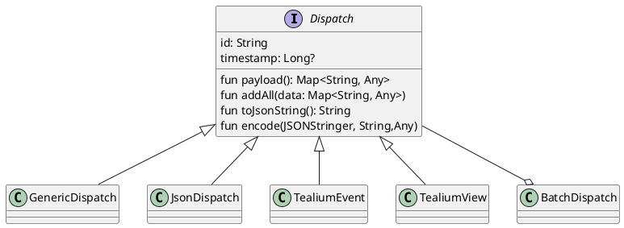
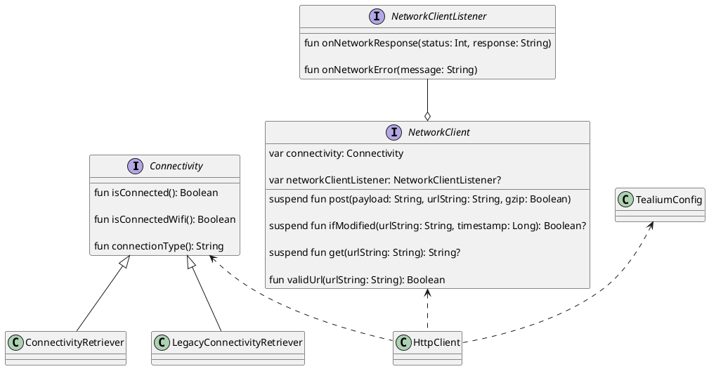
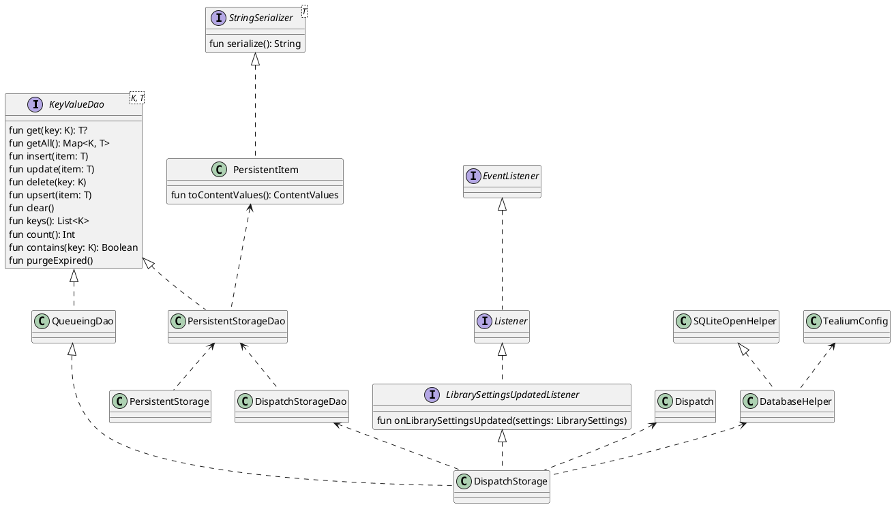

[TOC]


Tealium 分析， 以 1.2.4 版本为例

源码在： https://github.com/Tealium/tealium-kotlin

官方文档：https://docs.tealium.com/platforms/getting-started/


# 1.0 调用流程

## 1.1 初始化流程


说明：
① new 一个 TealiumConfig, 进行 Tealium 的一些配置

```kotlin
class TealiumConfig @JvmOverloads constructor(val application: Application,
                    val accountName: String,
                    val profileName: String,
                    val environment: Environment,
                    var dataSourceId: String? = null,
                    val collectors: MutableSet<CollectorFactory> = Collectors.core,
                    val dispatchers: MutableSet<DispatcherFactory> = mutableSetOf(),
                    val modules: MutableSet<ModuleFactory> = mutableSetOf()) {

    /**
     * A set of validators where any custom [DispatchValidator]s can be added. These will be merged
     * in with the built in validators when initializing the library.
     */
    val validators: MutableSet<DispatchValidator> = mutableSetOf()

    // 文件的存储路径
    private val pathName = "${application.filesDir}${File.separatorChar}tealium${File.separatorChar}${accountName}${File.separatorChar}${profileName}${File.separatorChar}${environment.environment}"
    val tealiumDirectory: File = File(pathName)

    /**
     * 用于存储一些额外的信息
     * Map of key-value pairs supporting override options that do not have a direct property on the
     * [TealiumConfig] object.
     */
    val options = mutableMapOf<String, Any>()

    /**
     * Gets and sets the initial LibrarySettings for the library. Useful defaults have already been
     * set on the [LibrarySettings] default constructor, but the default settings used by the
     * library can be set here.
     */
    var overrideDefaultLibrarySettings: LibrarySettings? = null

    /** 是否使用服务端的配置
     * Sets whether or not to fetch publish settings from a remote host.  
     */
    var useRemoteLibrarySettings: Boolean = false

    /**
     * 
     * Sets the remote URL to use when requesting updated remote publish settings.
     */
    var overrideLibrarySettingsUrl: String? = null

    /**
     * Set to false to disable deep link tracking.
     */
    var deepLinkTrackingEnabled: Boolean = true

    /**
     * Set to false to disable the QR code trace feature.
     */
    var qrTraceEnabled: Boolean = true

    /**
     * A list of EventTriggers for automatically starting and stopping TimedEvents.
     */
    var timedEventTriggers: MutableList<EventTrigger> = mutableListOf()

    init {
        tealiumDirectory.mkdirs()
    }
}

```

② 将一个 TealiumConfig 配置传入，创建一个 Tealium，可以有多个 Tealium， 内部使用 map 存储起来，同时还可以传入 onReady, 在 Tealium 初始化可以的时候进行回调

```kotlin
// Tealium.kt
 fun create(name: String, config: TealiumConfig, onReady: (Tealium.() -> Unit)? = null): Tealium {
            val instance = Tealium(name, config, onReady)
            instances[name] = instance
            return instance
}
```
③ Tealium#init 初始化 Tealium，初始化 Tealium 所需要的资源。


## 1.2 发送数据流程
以 track TealiumEvent 主要流程分析



① GenericDispatch 也是继承 Dispatch,它的 payload 是从传入的 dispatch 进行复制

```kotlin
internal class GenericDispatch(dispatch: Dispatch) : Dispatch {

    override val id: String = dispatch.id
    override var timestamp: Long? = dispatch.timestamp ?: System.currentTimeMillis()

    private val payload = shallowCopy(dispatch.payload())

    override fun payload(): Map<String, Any> {
        return payload.toMap()
    }

    override fun addAll(data: Map<String, Any>) {
        payload.putAll(data)
    }

```

② SessionManager#track
用于通知 SessionManager 发送一个新的 Dispatch，如果 Session 已经过期，则会生成一个新的 session.

③ DispatchRouter#track 
发放 Dispatch 的入口

```kotlin
fun track(dispatch: Dispatch) {
    if (settings.disableLibrary) {
        return
    }

    scope.launch(Logger.exceptionHandler) {
        // Collection
        dispatch.addAll(collect()) // 收集注册的 Collector
        transform(dispatch) // 在本地换缓存的 Data Layer 中查找

        // Validation - Drop ⑥
        if (shouldDrop(dispatch)) {
            scope.launch(Logger.exceptionHandler) {
                eventRouter.onDispatchDropped(dispatch)
            }
            return@launch
        }

        // Dispatch Ready ⑦
        scope.launch(Logger.exceptionHandler) {
            eventRouter.onDispatchReady(dispatch)
        }

        // Validation - Queue ⑧
        if (shouldQueue(dispatch)) {
            dispatchStore.enqueue(dispatch)
            scope.launch(Logger.exceptionHandler) {
                eventRouter.onDispatchQueued(dispatch)
            }
            return@launch
        }

        // Dispatch Send ⑨
        val queue = dequeue(dispatch).sortedBy { d -> d.timestamp }
        sendDispatches(queue) // ⑩
    }
}

```

④ collect
根据不同的 Collector， 收集不同的信息添加到 dispatch 的 map 中存储，
这些信息包含 app 信息，网络信息， 设备信息等，后面有详细的介绍。

⑤ transform
更新存储在本地的 dispatch 信息

⑥ shouldDrop
通过不同的 DispatchValidator 觉得是否抛弃 dispatch

⑦ onDispatchReady
分发到不同的 DispatchReadyListener， 准备 dispatch 已经 ready.

```kotlin
class EventDispatcher : EventRouter { 
    ...

    override fun onDispatchReady(dispatch: Dispatch) {
        listeners.forEach {
            when (it) {
                is DispatchReadyListener -> it.onDispatchReady(dispatch)
            }
        }
    }

    ...
}
```

⑧ shouldQueue 是否新进排队队列

⑨ dequeue 从队列里面弹出，也会触发 remote commands 

⑩ sendDispatches 网络发送
里面会根据要发送的 Dispatche 数量，决定是否是单个发生还是批量发生


```kotlin
class EventDispatcher : EventRouter { 
    ...

    // 单个发生
    override suspend fun onDispatchSend(dispatch: Dispatch) {
        listeners.forEach {
            when (it) {
                is DispatchSendListener -> {
                    if (it !is Module || it.enabled) {
                        it.onDispatchSend(dispatch)
                    }
                }
            }
        }
    }

    // 批量发送
    override suspend fun onBatchDispatchSend(dispatches: List<Dispatch>) {
    listeners.forEach {
        when (it) {
            is BatchDispatchSendListener -> {
                if (it !is Module || it.enabled) {
                    it.onBatchDispatchSend(dispatches)
                }
            }
        }
    }
}

    ...
}
```


# 2.0 Tealium 的设计

## 2.1 总体设计

<image src="tealium.excalidraw.png">


### 2.1.1 Tealium Core
Tealium core 是 Tealium 的核心，它包含 dispatcher, collection, messaging, setting, presistence, network, validation, events


**Tealium**
Tealium.kt 是 Tealium 入口，也是组织这个 Tealium 的核心。初始化的配置使用 TealiumConfig， TealiumContext 作为 Tealium 的上下文，在整个 lib 中都用使用。

**Dispatcher**
Dispatcher 里面包含用于分发事件的 TealiumEvent 和 TealiumView，以及 Dispatcher，关于这部分的详细说明在 2.1.8 Dispatcher 一节。

**Collection**
Collection 里面的 Collector 是用于收集一些信息


- AppCollector: 收集 app 相关的信息，例如: appVersion
- ConnectivityCollector: 收集网络连接的信息
- DeviceCollector: 收集设备相关的信息
- TealiumCollector: 收集 Tealium 相关的信息，例如:tealium_account，tealium_profile 等
- TimeCollector: 收集时间相关内容，例如：timestamp
- ModuleCollector: 收集 tealium 中 enable 的 module
- SessionCollector: 收集 session id 


**messaging**
主要包括 DispatchRouter， EventRouter 用来分发 message

**setting**
主要是 tealium 库的设置 LibrarySettings
在启动的时候会打印出来设置
例如：
```
 LibrarySettings updated: LibrarySettings(
    collectDispatcherEnabled=true, 
    tagManagementDispatcherEnabled=true, 
    batching=Batching(
        batchSize=1, 
        maxQueueSize=-1, 
        expiration=86400
    ), 
    batterySaver=false, 
    wifiOnly=false, 
    refreshInterval=60,
    disableLibrary=false, 
    logLevel=DEV
)
```

**persistence**
主要是本地数据库 SQLite 的存储，用来存放要发送的 message

**network**
主要是用来将 message 使用网络的形式发送出去，主要类是 HttpClient

**validation**
控制 Dispatch 是否发送，还是放到队列，亦或是抛弃，这个在 **2.4 发送数据策略设计** 中详细说明

**events**
主要是 TimedEvent 事件，以及它的相关管理，TimedEventsManager


### 2.1.2 Visitor
Visitor 模块 主要是用来管理 visitor 身份和属性相关内容

主要的类图，有省略




### 2.1.3 Crash reporter

Crash reporter 主要是用来上报 crash 相关的信息。
在 app crash 的时候，用 SharedPreferences save 存储 crash 的相关信息，然后在 ActivityObserver#onActivityResumed 的时候将存储的信息发送出去。

### 2.1.4 Ad identifler
获取谷歌广告的信息，然后存储在 dataLayer

### 2.1.5 Lifecycle

Lifecycle 模块主要是用来发送真个 app 的生命周期事件，包括启动，唤醒和休眠等。

### 2.1.6 Location

Location 模块主要是获取用户的经纬度坐标信息。
通过 `gms:play-services-location` 获取


### 2.1.7 InstallReferrer
InstallReferrer 模块用来获取 app 安装时的信息

### 2.1.8 Hosteddatalayer
Hosteddatalayer 模块管理其他模块提供的数据。

### 2.1.8 Dispatcher
Dispatcher 是 Tealium 的外围部分，是我自己的理解把它们放到一起的。它包含 collectdispatcher 模块，remotecommanddispatcher 模块和 tagmanagementdispatcher 模块 

**collectdispatcher**
collectdispatcher 是将 Dispatch 发送到 NetworkClient 中，它包含两个函数，一个是发送一个 Dispatch 的 onDispatchSend，另外一个是批量发送的 onBatchDispatchSend。

**RemoteCommand Dispatcher**
remotecommanddispatcher  通过tag 或 JSON 控制处理和评估客户端提供的命令.

**Tagmanagement Dispatcher**
tagmanagementdispatcher 是一个通过 webview 执行 JavaScript 的模块


Dispatch 的相关类



## 2.2 网络设计


通过 HttpClient#post 函数发送数据，它直接使用 HttpURLConnection 进行网络连接。

```kotlin
    override suspend fun post(payload: String, urlString: String, gzip: Boolean) = coroutineScope {
        if (isActive && isConnected) {
            try {
                with(URL(urlString).openConnection() as HttpURLConnection) {
                    try {
                        doOutput = true
                        setRequestProperty("Content-Type", "application/json")
                        val dataOutputStream = when (gzip) {
                            true -> {
                                setRequestProperty("Content-Encoding", "gzip")
                                DataOutputStream(GZIPOutputStream(outputStream))
                            }
                            false -> {
                                DataOutputStream(outputStream)
                            }
                        }
                        dataOutputStream.write(payload.toByteArray(Charsets.UTF_8))
                        dataOutputStream.flush()
                        dataOutputStream.close()
                    } catch (e: Exception) {
                        networkClientListener?.onNetworkError(e.toString())
                    }
                    networkClientListener?.onNetworkResponse(responseCode, responseMessage)
                }
            } catch (e: ConnectException) {
                Logger.prod(BuildConfig.TAG, "Could not connect to host: $e.")
                networkClientListener?.onNetworkError(e.toString())
            } catch (e: Exception) {
                Logger.prod(BuildConfig.TAG, "An unknown exception occurred: $e.")
                networkClientListener?.onNetworkError(e.toString())
            }
        }
    }

```


## 2.3 本地数据存储设计
本地数据存储在 Tealium core 的 presistence 中

DispatchStorage 对外的接口


说明

- DatabaseHelper 实现抽象类 SQLiteOpenHelper，用来管理数据库。
- DispatchStorage 数据管理对外的一个类，外部的对数据的调用都是通过此类。


## 2.4 发送数据策略设计

```kotlin
fun track(dispatch: Dispatch) {
    
    ...

    scope.launch(Logger.exceptionHandler) {
        ...

        // 抛弃
        if (shouldDrop(dispatch)) {
            scope.launch(Logger.exceptionHandler) {
                eventRouter.onDispatchDropped(dispatch)
            }
            return@launch
        }

        // Dispatch Ready
        scope.launch(Logger.exceptionHandler) {
            eventRouter.onDispatchReady(dispatch)
        }

        // 加入队列
        if (shouldQueue(dispatch)) {
            dispatchStore.enqueue(dispatch)
            scope.launch(Logger.exceptionHandler) {
                eventRouter.onDispatchQueued(dispatch)
            }
            return@launch
        }

        // 发送
        val queue = dequeue(dispatch).sortedBy { d -> d.timestamp }
        sendDispatches(queue)
    }
```

**是否抛弃 shouldDrop**

```kotlin
fun shouldDrop(dispatch: Dispatch): Boolean {
    return validators.filter { it.enabled }.fold(false) { input, validator ->
        input || validator.shouldDrop(dispatch).also { dropping ->
            if (dropping) Logger.qa(BuildConfig.TAG, "Dropping dispatch requested by: ${validator.name}")
        }
    }
}

```
**是否进队列**

```kotlin
fun shouldQueue(dispatch: Dispatch?, override: Class<out DispatchValidator>? = null): Boolean {
    return validators.filter { it.enabled }.fold(false) { input, validator ->
        input || if (override != null && override.isInstance(validator)) {
                    false
                } else validator.shouldQueue(dispatch).also { queueing ->
                    if (queueing) {
                        Logger.qa(BuildConfig.TAG, "Queueing dispatch requested by: ${validator.name}")
                        if (validator.name == "BATCHING_VALIDATOR") {
                            attemptSendRemoteCommand(dispatch)
                        }
                    }
                }
    }
}

```

Validator 决定 Dispatch 是否抛掉或者放到发送队列里面

```kotlin
/**
 * A DispatchValidator can be used to control the flow of Dispatches through the system. Each new
 * Dispatch will be sent to each Dispatch Validator; any one of them can signify that the Dispatch
 * should be either queued or dropped.
 */
interface DispatchValidator: Module {

    /**
     * Will be called for each new dispatch and for any revalidation events signified by a null
     * value for the [dispatch] parameter.
     *
     * @param dispatch the new dispatch, or null
     * @return true if the dispatch should be queued, otherwise false
     */
    fun shouldQueue(dispatch: Dispatch?): Boolean

    /**
     * Will be called for each new dispatch.
     *
     * @param dispatch the new dispatch
     * @return true if the dispatch should be queued, otherwise false
     */
    fun shouldDrop(dispatch: Dispatch): Boolean
}

```

在 Tealium#initializeValidators 中添加

```kotlin

/**
* Instantiates the built in validators and joins them with any supplied custom validators.
*/
private fun initializeValidators(customValidators: Set<DispatchValidator>): Set<DispatchValidator> {
    customValidators.forEach { it.enabled = true }
    return setOf<DispatchValidator>(
            BatteryValidator(config, librarySettingsManager.librarySettings, events),
            ConnectivityValidator(connectivity, librarySettingsManager.librarySettings),
            BatchingValidator(dispatchStore, librarySettingsManager.librarySettings, eventRouter)
    ).union(customValidators)
}
```

- **BatteryValidator**

如果是 enabled 获取是低电量则将 Dispatch 先放到队列中；
shouldDrop 默认 false.

```kotlin

override fun shouldQueue(dispatch: Dispatch?): Boolean {
    return (enabled && isLowBattery).also { queueing ->
        if (queueing) Logger.qa(BuildConfig.TAG, "Battery is low ($batteryLevel%)")
    }
}

override fun shouldDrop(dispatch: Dispatch): Boolean {
    return false
}

```

- **ConnectivityValidator**
如果在当我们对 Tealium 的 config 设定只是在 wifi 情况下发生，没有连接或者在其他网络也没连接的情况下，放到队列中；
shouldDrop 默认 false.

```kotlin
override fun shouldQueue(dispatch: Dispatch?): Boolean {
    return when(librarySettings.wifiOnly) {
        true -> {
            !(connectivityRetriever.isConnected() && connectivityRetriever.isConnectedWifi())
        }
        false -> {
            !connectivityRetriever.isConnected()
        }
    }
}

override fun shouldDrop(dispatch: Dispatch): Boolean {
    return false
}
```

- **BatchingValidator**
如果数据库里面存的数据数量 + 当前要发生的 1 个，小于设置的 batchSize， 则需要放到队列总。
shouldDrop 默认 false.

```kotlin
override fun shouldQueue(dispatch: Dispatch?): Boolean {
    val count = dispatchStorage.count()
    return batchSettings.maxQueueSize != 0 &&
            count + 1 < batchSettings.batchSize
}

override fun shouldDrop(dispatch: Dispatch): Boolean {
    return false
}
```

Batching 默认值如下

```kotlin
data class Batching(var batchSize: Int = 1,
                    var maxQueueSize: Int = 100,
                    var expiration: Int = 86400) 
```

# 3.0 借鉴的地方

## 3.1 良好的设计模式

- 良好的分层设计，将核心和外围拓展功能比较清晰的划分
- Collector 使用了迭代器设计模式
- 


# 4.0 其他
## 4.1 有启发的代码

### 4.1.2 重试
```kotlin
suspend fun <T> retry(numRetries: Int, timeout: Long, block: suspend (Int) -> T?): T? {
    for (i in 1..numRetries) {
        try {
            return withTimeout(timeout) {
                Logger.dev(BuildConfig.TAG, "Fetching resource; attempt number $i of $numRetries.")
                block(i)
            }
        } catch (e: TimeoutCancellationException) {
            Logger.prod(BuildConfig.TAG, "Timed out, could not fetch resource.")
        }
    }
    return block(0)
}
```

### 4.2.2 线程池和协程的结合

```kotlin
private val singleThreadedBackground = Executors.newSingleThreadExecutor().asCoroutineDispatcher()
   
private val backgroundScope = CoroutineScope(singleThreadedBackground)

 // Initialize everything else in the background.
backgroundScope.launch { 
    bootstrap()
}

```
这样 singleThreadedBackground 就是一个可以重复利用线程池里面的线程执行，并且可以使用协程

### 4.2.3 CoroutineExceptionHandler 处理异常

```kotlin
// Logger.kt
val exceptionHandler = CoroutineExceptionHandler { _, exception ->
        prod(BuildConfig.TAG, "Caught $exception")
        exception.stackTrace?.let { stackStrace ->
            prod(BuildConfig.TAG, stackStrace.joinToString { element ->
                element.toString() + "\n"
            })
        }
    }

 scope.launch(Logger.exceptionHandler) {
    ...
 }
```