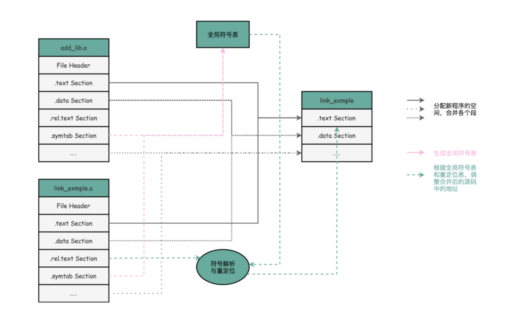

[TOC]


图片来自极客时间[深入浅出计算机原理](https://time.geekbang.org/column/article/94470)


# 学习链接知识的意义
- **理解链接将帮助你构建大型程序**
构建大型程序的程序员经常会遇到由于缺少模块、缺少库或者不兼容的库版本引起的连接器错误。除非你理解连接器是如何解析引用、什么是库以及链接器是如何使用库来解析引用的，否则这类错误将令你感到迷惑或挫折。

- **理解链接器将帮助你避免一些危险的编译错误**

- **理解链接将帮助你理解语言的作用域是如何实现的**
例如，全局和局部变量之间的区别是什么？当你定义一个具有 static 属性的变量或者函数时，到底意味着什么

- **理解链接将帮助你理解其他重要的系统概念**
链接器产生的可执行文件在重要的系统中扮演着关键角色，例如加载和运行程序、虚拟内存、分页和内存映射

- **理解链接将使你能够利用共享库**
这个在 Android 的动态加载 so 文件以及 Native hook 中会用，我会在后续提供这方面的应用

# 前言
链接器是把程序的各个部分合并成一个文件，处理器可以将这个文件加载到存储器，并且执行它。

链接可以在编译的时候有静态编译器来完成，也可以在加载时和运行时有动态链接器完成。

静态链接器（static linker）以一组可重定位目标文件和命令行参数作为输入，生成一个完全链接的可以加载和运行的可执行目标文件作为输出。

被编译为位置无关代码的共享库可以加载到任何地方，也可以在运行时被多个进程共享。为了加载、链接和访问共享的函数和数据，应用程序还可以在运行时使用动态链接器。

# 链接器的任务

链接器的主要两个任务是
- **符号解析（symbol resolution）**
- **重定位(relocation)**

**符号解析**
目标文件定义和引用符号，符号解析是将目标文件中的每个全局符号都绑定到一个唯一定义。

**重定位**
编译器和汇编器生成从地址 0 开始的代码和数据节。
链接器通过把每个符号定义与一个存储器位置联系起来，然后修改所有对这些符号的引用，使得它们指向这个存储器位置，从而重定位这些节


# 目标文件

目标文件是源代码编译后但为进行链接的那些中间文件（Window 的 .obj 和 Linux 下的 .o）

目标文件存粹是字节块的集合。

**目标文件的型式**
- **可重定位目标文件**
- **可执行目标文件**
- **共享目标文件**

## 可重定位的目标文件
可重定位的目标文件是静态连接器合并成一个可执行的目标文件，它可以加载到存储器中并执行

可重定位的目标文件包含二进制代码和数据，它是有在编译时与其他可重定位目标文件合并起来，形成一个可执行目标文件

## 共享目标文件
共享目标文件（共享库）是在运行时有动态链接器和加载的，在调用程序被加载和开始执行时，或者需要在程序调用 dlopen 库的函数。

目标共享文件是一种特殊类型的可重定位目标文件，可以在加载或者运行时被动态加载到存储器并链接。

## 加载
加载器将可以执行文件的内容映射到存储器，并运行这个程序。链接器还可能生出部分链接的可执行文件，这样的文件中有对定义在共享库中的程序和数据的未解析的引用。在加载时，加载器将部分链接的可执行文件映射到存储器，然后调用动态链接器，它通过加载共享库和重定位程序中的引用来完成链接任务。


# 相关命令

## 命令
```
gcc -c SimpleSection.c  // 生成目标文件
readelf -s link_example.o //查看符号表
objdump -r link_example.o //查看重定位表

> $readelf -h SimpleSection.o  // linex 用 

> $otool -h SimpleSection.o  // mac 使用

```

命令生成 pic 的 so
> gcc -fPIC -shared -o Link4.so link4.c

命令查看 GOT 的位置
> objdump -h Link4.so

查看 so 文件需要重定位项
> objdump -R Link4.so

生成 .out 文件
>

## Mac 使用 readelf
Mac 上没有 'readelf 命令' 可以使用 ’greadelf‘ 和 ’gobjdump‘
安装步骤：
1. 使用命令
> brew update && brew install binutils

2.路径添加到 ’~/.bash_profile‘ 文件中

```
# binutils
export PATH="/usr/local/opt/binutils/bin:$PATH"
export LDFLAGS="-L/usr/local/opt/binutils/lib"
export CPPFLAGS="-I/usr/local/opt/binutils/include"
```

## 查看 so 的文件格式

```
> file libdycloudmedia.so
libdycloudmedia.so: ELF 64-bit LSB shared object, ARM aarch64, version 1 (SYSV), dynamically linked, BuildID[sha1]=2bcf3eae561f0f6ca25b0f2abd0728eef68f9ea3, stripped

```



图片来自极客时间[深入浅出计算机原理](https://time.geekbang.org/column/article/94470)

# 参考

- https://fengmuzi2003.gitbook.io/csapp3e/di-er-zhang-zhong-dian-jie-du
- https://www.bilibili.com/video/BV1a54y1k7YE?p=13


