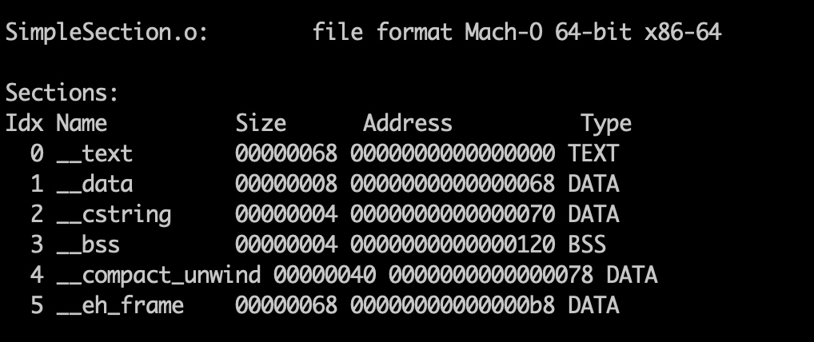
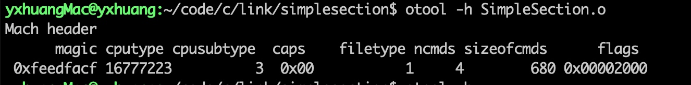
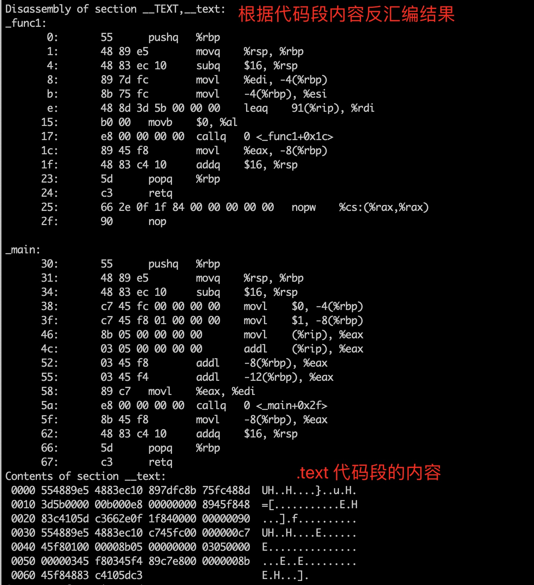
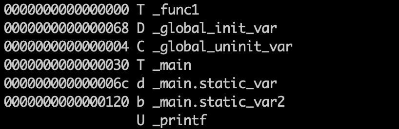

[TOC]
# 一、目标文件的格式

目标文件是源代码编译后但为进行链接的那些中间文件（Window 的 .obj 和 Linux 下的 .o）

动态链接库（DLL, Dynamic Linking Library）, Window 是 .dll， Linux 是 .so
静态链接库（Static Linking Library）, Window 是 .lib 和 Linux 是 .a

可执行文件格式是 ELF

# 二、目标文件的文件类型

 


命令 file 查看文件的类型格式
例如

```
> file libdycloudmedia.so 
libdycloudmedia.so: ELF 64-bit LSB shared object, ARM aarch64, version 1 (SYSV), dynamically linked, BuildID[sha1]=2bcf3eae561f0f6ca25b0f2abd0728eef68f9ea3, stripped

```

# 三、目标文件的内容


## 3.1 可执行文件的内容

程序源代码编译后的机器指令经常被放在**代码段（Code Section）**, 代码段常见的字有 ".code" 或 ”.text"

全局变量和局部变量数据经常放在**数据段（Data Section）**

总体来说，源程序代码被编译以后主要分成两种段，程序指令和程序数据。代码段属于程序指令，而数据段和.bss 属于程序数据

将数据和指令分段的好处：
- 程序被装载后，数据和指令分别被映射到两个虚拟区域。数据区对于进程是可读写，指令区对于进程是只读，这两个两个区域的权限分别设置为可读写和只读。这样防止程序指令被破坏
- 充分利用 CPU 的缓存，提供命中率
- 当系统中存在该程序的副本时，可以共享指令，节约内存。

**查看 ELF 各段的基本信息**

> objdump -h SimpleSection.o
> -h 将 ELF 文件的各个段的基本信息打印出来



**查看ELF文件的代码段、数据段、和 BSS 段的长度**

> size SimpleSection.o
> 


## 3.2 文件头 HEADER
ELF 目标文件最前面的是 ELF 文件头，它包含描述整个文件的基本属性，例如 ELF 文件版本、目标机器型号、程序入口等

查看

> $readelf -h SimpleSection.o  // linex 用 

> $otool -h SimpleSection.o  // mac 使用



## 3.3 代码段 .text

使用命令下面命令查看

> objdump -s -d SimpleSection.o 
> -s 参数表示将所有段的内容以十六进制的方式打印出来
> -d 参数将所有包含指令的段反汇编




## 3.3 数据段和只读数据段 .data

.data 段保存已经初始化了的全局静态变量和局部静态变量

.rodata 段存放只读数据,(mac 里面是 cstring )

```
Contents of section __data:
 0068 54000000 55000000                    T...U...
Contents of section __cstring:
 0070 25640a00                             %d..
```


## 3.4 BSS 段
.bss 段存放未初始化的全局变量和局部静态变量

```
Contents of section __bss:
<skipping contents of bss section at [0120, 0124)>

```

# 四、ELF 文件结构描述

**链接过程的本质就是要把多个不同的目标文件之间相互”粘“到一起，或者说像玩具积木一样，可以拼成一个整体**

符号是链接过程的粘合剂


## 4.1  重新定位表 .rel.text 

链接器在处理目标文件时，必须要对目标文件中某些部位进行重定位

## 4.2  符号
链接过程的本质就是把不同的目标文件相互“粘”到一起，拼成一个整体。符号就是链接中的粘合剂，整个链接过程正是基于符号才能正确完成的。

查看符号表
> $ nm SimpleSection.o



**ELF 符号表结构**

```C
typedef struct {
    Elf32_Word st_name;     // 符号名
    Efl32_Addr st_value;    // 对应的值
    Elf32_Word st_size;     // 符号大小
    unsigned char st_info;  // 符号类型和绑定信息
    unsigned char st_other; // 0, 暂时没有用途
    Elf32_Half st_shndx;    // 符号所在的段
} Elf32_Sym;
```


# 五、其他

## 示例代码

```c
#include <stdio.h>

int printf(const char* fromt, ...);

int global_init_var = 84;
int global_uninit_var;

void func1(int i){
    printf("%d\n", i);
}

int main(void){
    static int static_var = 85;
    static int static_var2;
    int a = 1;
    int b;

    func1(static_var + static_var2 + a + b);

    return a;
}
```

## Mac 使用 readelf
Mac 上没有 'readelf 命令' 可以使用 ’greadelf‘ 和 ’gobjdump‘
安装步骤：
1. 使用命令
> brew update && brew install binutils

2.路径添加到 ’~/.bash_profile‘ 文件中

```
# binutils
export PATH="/usr/local/opt/binutils/bin:$PATH"
export LDFLAGS="-L/usr/local/opt/binutils/lib"
export CPPFLAGS="-I/usr/local/opt/binutils/include"
```

## Mac otool替代readelf命令

$otool -h

```
rg] [--version] <object file> ...
	-f print the fat headers
	-a print the archive header
	-h print the mach header
	-l print the load commands
	-L print shared libraries used
	-D print shared library id name
	-t print the text section (disassemble with -v)
	-x print all text sections (disassemble with -v)
	-p <routine name>  start dissassemble from routine name
	-s <segname> <sectname> print contents of section
	-d print the data section
	-o print the Objective-C segment
	-r print the relocation entries
	-S print the table of contents of a library (obsolete)
	-T print the table of contents of a dynamic shared library (obsolete)
	-M print the module table of a dynamic shared library (obsolete)
	-R print the reference table of a dynamic shared library (obsolete)
	-I print the indirect symbol table
	-H print the two-level hints table (obsolete)
	-G print the data in code table
	-v print verbosely (symbolically) when possible
	-V print disassembled operands symbolically
	-c print argument strings of a core file
	-X print no leading addresses or headers
	-m don't use archive(member) syntax
	-B force Thumb disassembly (ARM objects only)
	-q use llvm's disassembler (the default)
	-Q use otool(1)'s disassembler
	-mcpu=arg use `arg' as the cpu for disassembly
	-j print opcode bytes
	-P print the info plist section as strings
	-C print linker optimization hints
	--version print the version of /Users/yxhuang/software/xcode/Xcode.app/Contents/Developer/Toolchains/XcodeDefault.xctoolchain/usr/bin/otool
```

