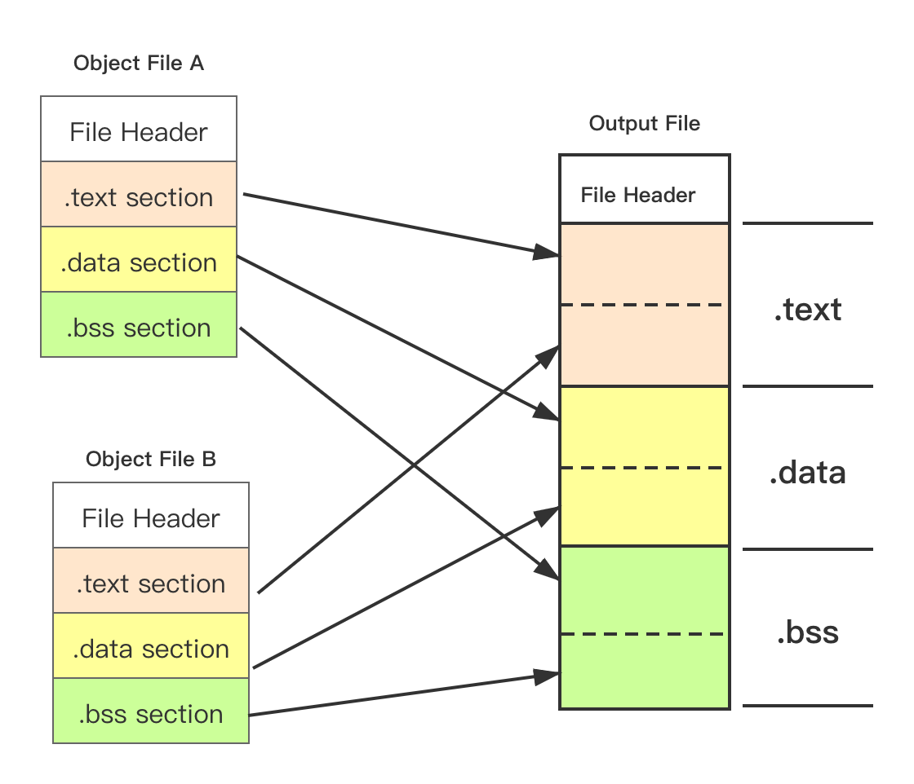

第四章 静态链接

[TOC]


这是《程序员自我修养--链接、装载与库》读书笔记的第三篇，静态链接。

**简单来说静态链接将多个目标文件性质相同部分，合并写入到输出目标文件中，然后将符号解析并且对外部引用符号重新定位。**

**目标文件的链接分为静态链接和动态链接**。

**静态链接**是以多个重定位目标文件和命令参数作为输入，生成一个完全链接的可以加载和运行的可执行目标文件的过程。

这个过程由链接器完成，**链接器主要的任务就是符号解析（sysbol resolution） 和重定位（relocation）**

**动态链接（Dynamic Linking）**为了解决静态链接中存在的空间浪费和更新困难的问题，把程序的模块相互分割开来，形成独立文件，不是将它们静态链接到一起。把链接过程推迟到运行时进行，这就是动态链接。

## 一、空间与地址分配
链接器是将多个目标文件相同性质的段合并到一起，并为目标文件分配地址和空间。
这里的地址和空间一是指在输出的可执行文件中的空间，二是指在转载后的虚拟地址中的虚拟地址空间。

链接器分两步链接：

- **1.空间与地址分配**
扫描所有的输入目标文件，获得它们的各个段的长度、属性和位置，并且将输入目标文件中的符号表中所有符号定义和符号引用收集起来，统一放到一个全局符号表。

- **2.符号解析和重定位**
使用第一步收集到的信息，读取输入文件中段的数据、重定位信息，并且进行符号解析与重定位、调整代码中的地址等。



例子：

### 1.1 符号地址的确定
Linux 下， ElF 可执行文件默认地址从 0x08048000 开始分配。

在扫描和空间分配阶段，链接器对空间进行分配，这个时候各个段在链接后的虚拟地址已经确定。各个符号在段内的相对位置是固定的，它们在合并后的位置等于段位置虚拟地址加上偏移地址

**合并后目标文件中的符号地址 = 段虚拟地址 + 偏移地址**

【缺清单 4-1】
【缺图 4-3】

## 二、符号解析与重定位
### 2.1 重定位
当源文件有外部符号，编译的时候，会把外部符号的地址用 0 替代，所以，把原始目标文件需要重定位。

链接器根据重定位表（Relocation Table） 获取重定位的信息.

重定位表在目标文件的 ”.rel.text“ 段

**重新定位入口的结构**

```c
typedef struct {
    Efl32_Addr r_offset;
    Elf32_Word r_info;
} Elf32_Rel;
```
说明：
- r_offset， 重定位入口的偏移
- r_info， 重定位入口的类型和符号


```
a.o:     file format mach-o-x86-64

RELOCATION RECORDS FOR [.text]:
OFFSET           TYPE              VALUE
000000000000001b BRANCH32          _swap
000000000000000b GOT_LOAD          _shared


RELOCATION RECORDS FOR [__LD.__compact_unwind]:
OFFSET           TYPE              VALUE
0000000000000000 64                .text
```

### 2.2 符号解析
目标文件中外部符号时，需要在重定位的时候对这个符号进行解析。

在重定位时，链接器查找所有输入目标文件的符号组成的全局符号表，找到相应的符号后进行重定位。

例子：

```
$ ld a.o

Undefined symbols for architecture x86_64:
  "_shared", referenced from:
      _main in a.o
  "_swap", referenced from:
      _main in a.o
ld: symbol(s) not found for architecture x86_64
```
在 a.c 文件中， `shared` 和  `swap` 是 b.c 文件中定义的，直接有 ld 链接 a.o 会发现这两个符号未定义

### 2.3 指令修正
不同的处理器指令对于地址的格式和方式是不一样的，因此一些指令需要修正。

重定位入口 r_info 成员低 8 位表示重定位入口类型

 
| 宏定义 | 值 |重定位修正方法|
| --- | --- | --- | ---|
| R_368_32| 1 | 绝对寻址修正 S + A | |
| R_386_PC32| 2 | 相对寻址修正 S + A -P|

A = 保存在被修正位置的值
P = 被修正的位置（相对于段开始的偏移量或者虚拟地址），注意，该值可通过 r_offset 计算得到
S = 符号的实际地址，即由 r_info

**绝对寻址修正**
P110【缺】

**相对寻址修正**
P110【缺】

## 三、弱符号解析
由于弱符号机制允许同一个符号的定义存在于多个文件中，会导致问题：如果一个弱符号定义在多个目标文件中，它们的类型有不同，就会面临多个符号定义不一致的情况。

主要分三种情况：

- 两个或两个以上强符号类型不一致；
- 有一个强符号，其他都是弱符号，出现类型不一致；
- 两个或两个以上弱符号类型不一致

弱符号链接的规则在 .common 段中。

对第一种情况，链接器会报符号多重定义错误，不需要处理；

对第二种情况，输出结果中的符号所占空间以强符号的为准；

对第三种情况，输出结果以输入文件中最大的那个为准；


