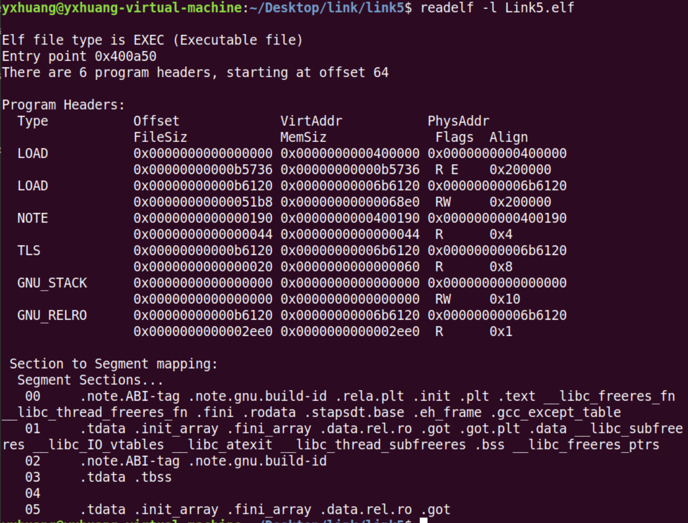

[toc]

这一章讲述了操作系统入口将 ELF 文件装载到内存的过程。

# 1. 装载的方式

程序在运行时有局部性原理，可以将程序最常用的部分驻留在内存中，将不常用的数据存放在磁盘里。

加载的时候采用**页映射**的方式，也映射就是把部分程序的数据和指令按“页（page）” 为单位划分成若干个页，以后所有的装载和操作的单位就是页。

# 2. 装载的过程

操作系统加载目标文件的过程主要分为三步：

- 创建一个独立的虚拟地址空间
- 读取可执行文件头，并且建立虚拟空间与可执行文件的映射关系
- 将 CPU 的指令寄存器设置成可执行文件的入口地址，启动运行

### 2.1 创建一个独立的虚拟地址空间
 创建进程，就是创建一个独立的虚拟地址空间，虚拟空间由一组页映射函数将虚拟空间的各个页映射至相应的物理空间。

### 2.2 读取可执行文件头，并且建立虚拟空间与可执行文件的映射关系

**这一步主要做的是，建立虚拟空间与可执行文件的映射关系,这种映射关系只是保存在操作系统内部的一个数据结构。**

建立映射时，是将权限相同的 section 合并到一个 Segment, 再进行映射。这样可以节约内存。

ELF 中一般是一下的三种组合：

- 以代码段为代表的权限为可读可执行的段
- 以数据段和 BSS 段为代表的权限为可读可写的段
- 以只读数据段为代表的权限为只读的段

上图就是例子，左边是没有合并 Segment 进行映射，右边是合并 Segment 进行映射的。.init 和 .text 段都是权限相同、可读可执行的段，将它们合并成通过 Segment 进行映射，节约了内存空间

通过命名可以查看 ELF 文件中哪些段合并了 Segment 
> $readelf -l SectionMapping.elf

### 2.3 将 CPU 的指令寄存器设置成可执行文件的入口地址，启动运行

操作系统通过设置 CPU 的指令寄存器将控制权转交给进程,程序由此开始运行。这个地址是在 ELF 头文件中保存的

程序运行时会产生一个**“页错误（Page Fault）”**,这是因为在 2.3 步，操作系统仅仅只是通过可执行文件的头文件信息建立可执行文件和进程虚拟空间的映射关系而已，并没有加载可执行文件的真正指令和数据到内存。

操作系统处理页错误后，把指令和数据加载进内存，计算出相应的页面在可执行文件中的偏移，然后在物理内存中分配一个物理页面，将进程中该虚拟页与分配的物理页建立映射关系，控制权交回给进程，程序重新开始运行。

# 3. 堆和栈
操作系统通过给进程空间划分一个个 VMA（虚拟内存空间） 来管理进程的虚拟空间；基本原则是将相同属性的、有相同映像文件的映射成一个 VMA.

一个进程基本上划分为以下结果 VMA 区域：

- 代码 VMA , 权限只读、可执行；有映像文件；
- 数据 VMA, 权限可读写、可执行；有映像文件；
- 堆 VMA, 权限可读写、可执行；无映像文件，匿名，可向上扩展；
- 栈 VMA, 权限可读写、不可以执行；无映像文件，匿名，可向下扩展。

# 4. Linux 内核装载 ELF 过程

- 1. 检测 ELF 可执行文件的有效性，例如魔数，程序头表中 Segment 的数量；
- 2. 寻找动态链接的 “.interp” 段，设置动态链接器路径
- 3. 根据 ELF 可执行文件的程序头表的描述，对 ELF 文件进行映射，例如代码、数据、只读数据
- 4. 初始化 ELF 进程环境，例如进程启动时 EDX 寄存器的地址应该是 DT_FINI 的地址
- 5. 将系统调用的返回地址修改成 ELF 可执行文件的入口点，这个入口点取决于程序的链接方式，对于静态链接的 ELF 可执行文件，这个程序入口是 ELF 文件头中 e_entry 所指的地址；对于动态链接的 ELF 可执行文件，程序入口点是动态链接器。

 

