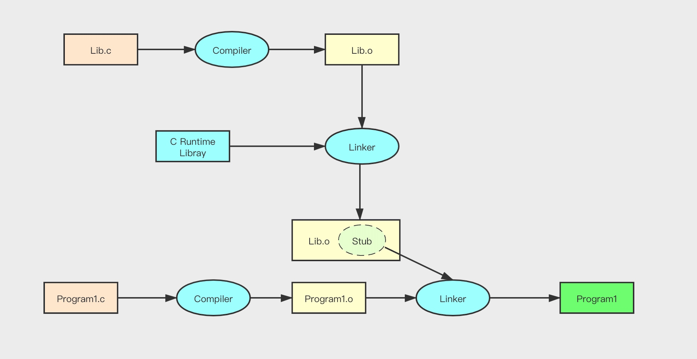
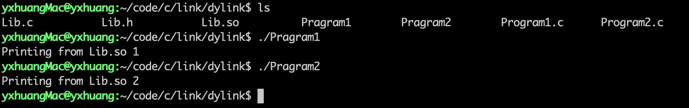
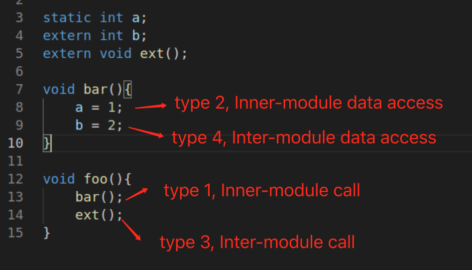
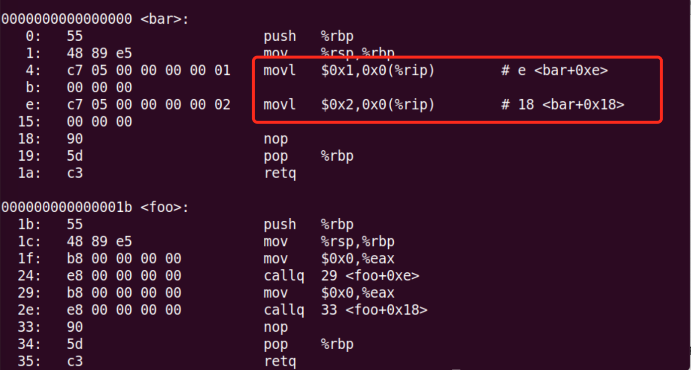
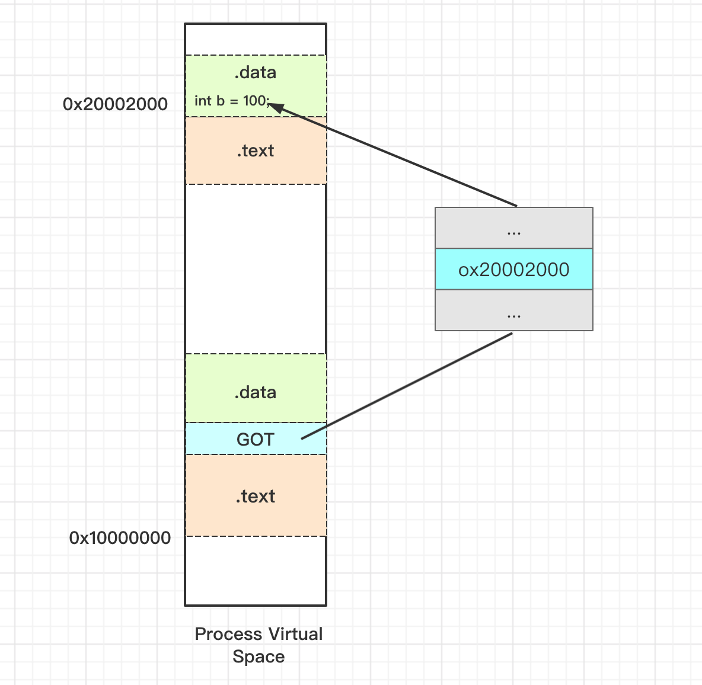
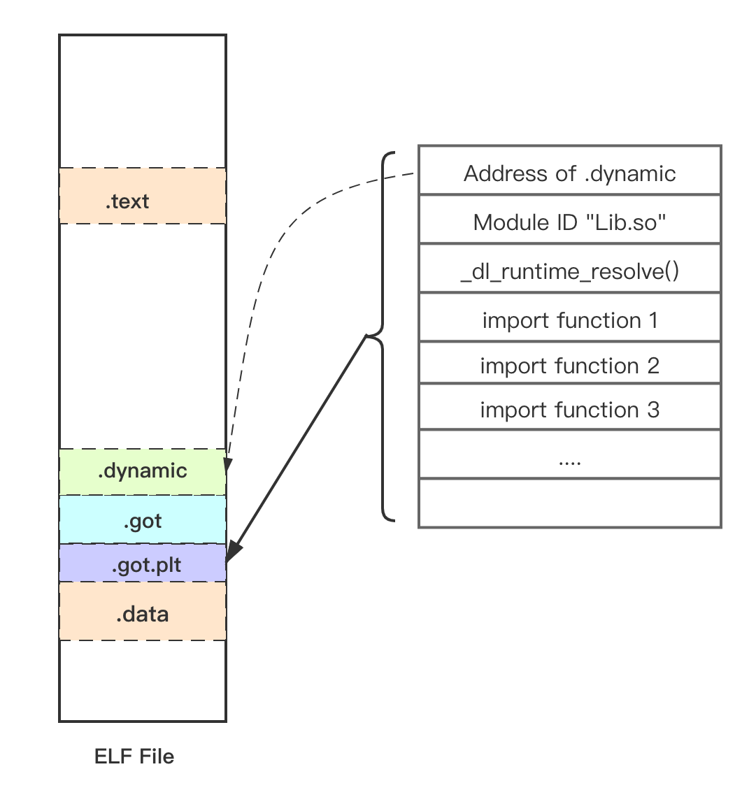
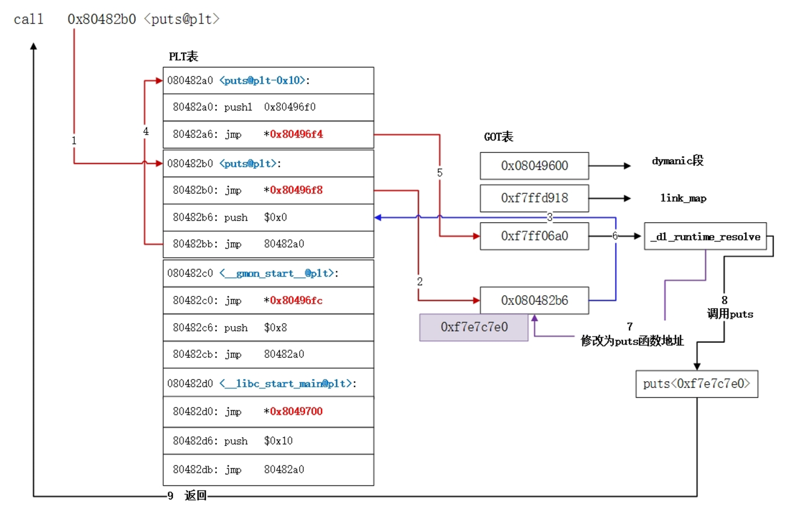
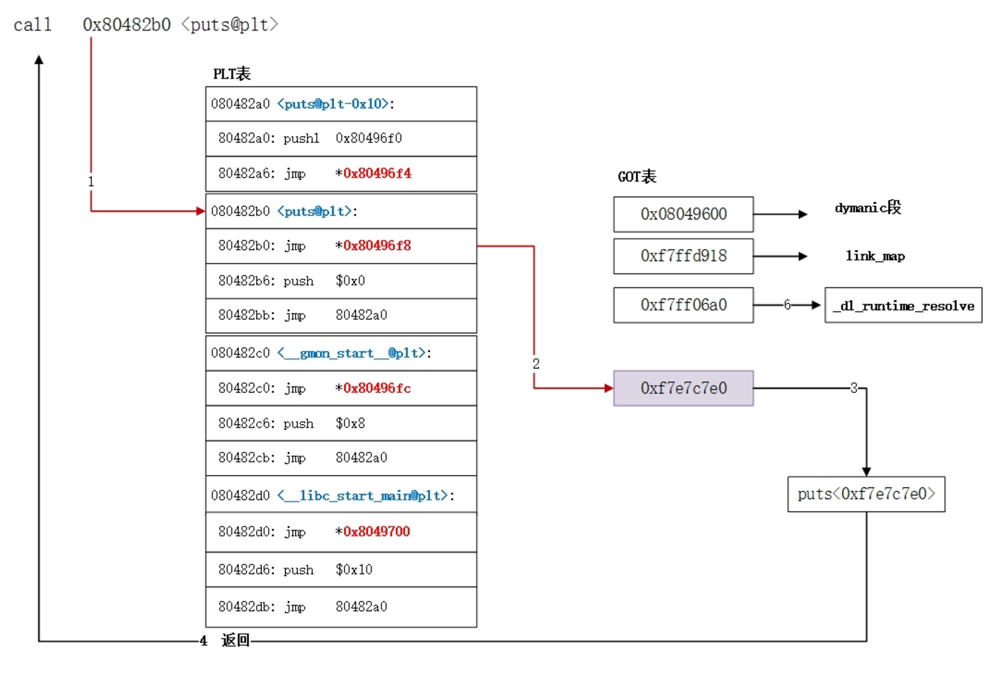

[TOC]

这章主要首先讲述了动态链接是为了解决静态链接浪费内存和磁盘资源的问题，同时更加方便升级程序。

动态链接需要面临装载地址不确定的问题，为了解决这个问题，引入了装载时重定位和地址无关代码这两个方法。然后讲述这两个方法的优缺点。同时还介绍了延迟绑定 PLT 技术。

中间讲述了 ELF 文件中的 ”.interp“, ".dyanmic", 动态符号表、重定位表等结构。

最后还讲述了显示动态链接的概念，这个概念在 Android Ndk 的开发中需要应用，后续我会用特定的篇章讲述动态链接在 Android NDK 中的应用。

# 1. 动态链接


## 1.1 为什么需要动态链接

为了解决静态链接的空间浪费和更新困难问题，需要动态链接。

动态链接（Dynamic Linking）就是把不对那些组成程序的目标文件进行链接，而是把链接的过程推迟到运行时再进行。


## 1.2 动态链接的基本实现

动态链接的基本思想是把程序安装模块拆分成各个相对独立部分，在程序运行时才会将它们链接在一起，形成一个完整程序，而不是像静态链接那样把所以的程序模块都链接成一个单独的可执行文件。

在 Linux 系统中， ELF 动态链接文件被称为**动态共享对象（Dynamic Shared Objects）, 以 .so 为扩展名**

在 Window 中，被称为**动态链接库（Dynamic Linking Library）, 以 .dll 为扩展名**

共享对象的最终装载地址在编译时是不确定的，而是在装载时，装载器根据当前地址空间的空闲情况，动态分配一块足够大小的虚拟地址空间给相应的共享对象。

例子：


输出的结果




# 2. 地址无关代码

共享对象在编译时不能假设自己在进程虚拟地址空间中的位置，在链接时，对所有绝对地址的引用不作重定位，而是把这一步推迟到装载时在完成。

装载时重定位是解决动态模块中有绝对地址引用的方法之一。这时候会用到地址不关代码技术。

**地址无关代码（PIC, Position-independent Code）**是指，程序模块中的指令部分在装载是不需要因为装载地址的改变而改变，所以实现的基本思想是把指令中那些需要被修改的部分分离出来，跟数据部分放在一起，这样指令部分可以保持不变，而数据部分可以在每个进程中拥有一个副本。

命令生成 pic 的 so
> $gcc -fPIC -shared -o Link4.so link4.c

## 2.1 模块内的调用类型

安装共享模块中的地址引用按照是否为跨模块分成两类：模块内引用和模块外部引用；
按照不同的引用方法分为指令引用和数据访问

得到下面四种类型的地址引用方式：

- 第一种是模块内的函数调用、跳转等。
- 第二种是模块内的数据访问，比如模块中定义的全局变量、静态变量等
- 第三种是模块外部的函数调用、跳转等
- 第四种是模块外部的数据访问，比如其他模块中定义的全局变量

下图说明四种情况调用



### 2.1.1 类型一 模块内部调用或跳转

模块内的跳转、函数调用是相对地址调用，或者是基于寄存器的相对调用，所以对于这类指令不需要重定位。

### 2.1.2 类型二 模块内部数据访问

指令中不能包含数据的绝对地址，只能使用相对寻址。

任何一条指令与它需要访问的模块内部数据之间的相对位置是固定的，只需要相对于当前指令加上固定的偏移量就可以访问数据内部数据。



说明：
【缺，待补充】

### 2.1.3 类型三 模块间数据访问

模块间的数据访问目标地址是要等到装载时才决定的，因此把跟地址相关的部分放到数据段里面。这些数据是和模块的加载地址是相关的。

ELF 的做法是建立一个**全局偏移表（Global Offset Table, GOT）**, 指向这些变量。当代码需要引用全局变量时，可以通过 GOT 中相对应的项间接引用。

GOT 以及后面要讲到的 PLT 在 Android 的 Native Hook 中有具体的应用，后续会用特定的篇章讲述这些应用。




说明：
当指令要访问变量 b 时，程序先找到 GOT 表，然后根据 GOT 中变量所对应的项找到变量的目标地址

命令查看 GOT 的位置

> $objdump -h Link4.so

```
 7 .plt          00000030  0000000000000510  0000000000000510  00000510  2**4
                  CONTENTS, ALLOC, LOAD, READONLY, CODE
  8 .plt.got      00000008  0000000000000540  0000000000000540  00000540  2**3
                  CONTENTS, ALLOC, LOAD, READONLY, CODE
  9 .text         00000113  0000000000000550  0000000000000550  00000550  2**4
                  CONTENTS, ALLOC, LOAD, READONLY, CODE
 10 .fini         00000009  0000000000000664  0000000000000664  00000664  2**2
                  CONTENTS, ALLOC, LOAD, READONLY, CODE
 11 .eh_frame_hdr 0000002c  0000000000000670  0000000000000670  00000670  2**2
                  CONTENTS, ALLOC, LOAD, READONLY, DATA
 12 .eh_frame     0000009c  00000000000006a0  00000000000006a0  000006a0  2**3
                  CONTENTS, ALLOC, LOAD, READONLY, DATA
 13 .init_array   00000008  0000000000200e48  0000000000200e48  00000e48  2**3
                  CONTENTS, ALLOC, LOAD, DATA
 14 .fini_array   00000008  0000000000200e50  0000000000200e50  00000e50  2**3
                  CONTENTS, ALLOC, LOAD, DATA
 15 .dynamic      00000180  0000000000200e58  0000000000200e58  00000e58  2**3
                  CONTENTS, ALLOC, LOAD, DATA
 16 .got          00000028  0000000000200fd8  0000000000200fd8  00000fd8  2**3
                  CONTENTS, ALLOC, LOAD, DATA
 17 .got.plt      00000028  0000000000201000  0000000000201000  00001000  2**3
                  CONTENTS, ALLOC, LOAD, DATA
 18 .data         00000008  0000000000201028  0000000000201028  00001028  2**3
                  CONTENTS, ALLOC, LOAD, DATA
```

其中 got 段的位置

```
16 .got          00000028  0000000000200fd8  0000000000200fd8  00000fd8  2**3
```

**“.got”用来保存全局变量引用的地址，“.got.plt”用来保存函数引用的地址**


查看 so 文件需要重定位项

> $objdump -R Link4.so

```
yxhuang@yxhuang-virtual-machine:~/Desktop/linck/link4$ objdump -h link4.o

link4.o:     file format elf64-x86-64

Sections:
Idx Name          Size      VMA               LMA               File off  Algn
  0 .text         00000036  0000000000000000  0000000000000000  00000040  2**0
                  CONTENTS, ALLOC, LOAD, RELOC, READONLY, CODE
  1 .data         00000000  0000000000000000  0000000000000000  00000076  2**0
                  CONTENTS, ALLOC, LOAD, DATA
  2 .bss          00000004  0000000000000000  0000000000000000  00000078  2**2
                  ALLOC
  3 .comment      0000002a  0000000000000000  0000000000000000  00000078  2**0
                  CONTENTS, READONLY
  4 .note.GNU-stack 00000000  0000000000000000  0000000000000000  000000a2  2**0
                  CONTENTS, READONLY
  5 .eh_frame     00000058  0000000000000000  0000000000000000  000000a8  2**3
                  CONTENTS, ALLOC, LOAD, RELOC, READONLY, DATA

```

变量 b 的地址需要重定位，它的偏移地址是 0x200fd8

这些信息存在动态链接的重定位表中，包含 ”rel.dyn“ 和 ”.rel.plt“

- ”rel.dyn“ 表示对数据引用的修正，它修正的位置位于 ”.got“以及数据段；
- ”rel.plt“ 表示对函数的修正，它所修正的位置位于 ”.got.plt“

通过命名查看动态链接的文件重定位表
> $readelf -r Link4.so

```
$ readelf -r Link4.so

Relocation section '.rela.dyn' at offset 0x408 contains 8 entries:
  Offset          Info           Type           Sym. Value    Sym. Name + Addend
000000200e48  000000000008 R_X86_64_RELATIVE                    620
000000200e50  000000000008 R_X86_64_RELATIVE                    5e0
000000201028  000000000008 R_X86_64_RELATIVE                    201028
000000200fd8  000200000006 R_X86_64_GLOB_DAT 0000000000000000 b + 0
000000200fe0  000300000006 R_X86_64_GLOB_DAT 0000000000000000 __cxa_finalize + 0
000000200fe8  000400000006 R_X86_64_GLOB_DAT 0000000000000000 _ITM_registerTMCloneTa + 0
000000200ff0  000500000006 R_X86_64_GLOB_DAT 0000000000000000 _ITM_deregisterTMClone + 0
000000200ff8  000600000006 R_X86_64_GLOB_DAT 0000000000000000 __gmon_start__ + 0

Relocation section '.rela.plt' at offset 0x4c8 contains 2 entries:
  Offset          Info           Type           Sym. Value    Sym. Name + Addend
000000201018  000100000007 R_X86_64_JUMP_SLO 0000000000000000 ext + 0
000000201020  000a00000007 R_X86_64_JUMP_SLO 000000000000062a bar + 0
```

$readelf -S Link4.so

```
...
[16] .dynamic          DYNAMIC          0000000000200e58  00000e58
       0000000000000180  0000000000000010  WA       4     0     8
  [17] .got              PROGBITS         0000000000200fd8  00000fd8
       0000000000000028  0000000000000008  WA       0     0     8
  [18] .got.plt          PROGBITS         0000000000201000  00001000
       0000000000000028  0000000000000008  WA       0     0     8
  [19] .data             PROGBITS         0000000000201028  00001028
       0000000000000008  0000000000000000  WA       0     0     8
...
```

### 2.1.4 类型四 模块间调用和跳转

对应模块间的跳转、函数调用，可以用类型三的方法解决。
不过 GOT 中保存的是目标函数的地址。

例子：
当 foo() 方法里面要调用外部的的 ext() 函数时，先得到当前指令地址 PC, 然后加上一个偏移得到函数地址在 GOT 中的偏移，然后得到一个间接调用。

```
000000000000001b <foo>:
  1b:	55                   	push   %rbp
  1c:	48 89 e5             	mov    %rsp,%rbp
  1f:	b8 00 00 00 00       	mov    $0x0,%eax
  24:	e8 00 00 00 00       	callq  29 <foo+0xe>
  29:	b8 00 00 00 00       	mov    $0x0,%eax
  2e:	e8 00 00 00 00       	callq  33 <foo+0x18>
  33:	90                   	nop
  34:	5d                   	pop    %rbp
  35:	c3                   	re
```
其中 

> 24:	e8 00 00 00 00       	callq  29 <foo+0xe> 

是对 ext 的调用

**定义在模块内部的全局变量，也是可以当作定义在其他模块的全局变量，用类型4 解决**

### 2.5 数据段地址无关性

```
static int a;
static int* p = &a;
```
指针 p 的地址是一个绝对地址，指向变量 a 的地址，而变量 a 的地址会随着共享对象的装载地址改变而改变。

数据段，它在每个进程都有一份独立的副本。

装载时重定位的方法解决数据段中绝对地址引用问题。如果数据段中有绝对地址引用，编译器和链接器就会产生一个重定位表。


# 3. 延迟绑定

动态链接比静态链接慢的原因：

- 1. 动态链接下对全局和静态的数据访问都要进行复杂的 GOT 定位，然后间接寻址；对于模块间的调用也要先定位 GOT， 然后再进行间接跳转
- 2. 动态链接的链接工作是在运行时完成

为了解决动态链接慢的问题，采取延迟绑定的方式。

延迟绑定（Lazy Binding) 是当函数第一次用到时才进行并对（符号查找、重定位等），如果没有用到则不进行绑定。

ELF 使用 **PTL(Procedure Linkage Table)** 的方式来实现。

**PTL 原理：当调用外部模块的函数时，通过 PTL 新增加的一层间接跳转。调用函数并不直接通过 GOT 跳转，而是通过一个叫作 PLT 项的结构来进行跳转。每个外部函数在 PLT 中都有一个相应的项。**

例子说明：
调用一个模块外的函数，需要知道这个函数所在的模块 moduleID 和 函数名称

以调用 bar() 函数说明

```
bar@plt:
jmp *(bar@GOT)
push n
push moduleID
jmp _dl_runtime_resolve
```
说明：

- **jmp *(bar@GOT)** 是一条通过 GOT 跳转的指令。 bar@GOT 表示 GOT 中存有 bar() 函数相应的项。
  链接器在初始化的时候没有将 bar() 的地址填入该项，而是调用下一条指令 ` push n`
- **push n** 表示将地址填入 bar@GOT, n 代表 bar 这个符号引用在重定位 “.rel.plt” 中的下标
- **push modudeID** 表示将模块 ID 压入到堆栈中
- **jmp _dl_runtime_resolve** 表示跳转到 `_dl_runtime_resolve` ，将 bar() 的真正地址填入到 bar@GOT 中。

一旦 bar() 这个函数被解析完毕，当我们再次调用 bar@plt 时，第一条 jmp 指令就能够跳转到真正的 bar() 函数中，bar() 函数返回的时候会根据堆栈里面保存的 EIP 直接返回调用者，而不会再继续执行 bar@plt 中后面的代码。



".got.plt"说明

- 第一项保存的是 “.dynamic” 段的地址，这个段描述了本模块动态链接相关的信息
- 第二项是保存本模块的 ID
- 第三项保存的是 "_dl_runtime_resolve()" 的地址

例子说明
第一次加载时


之后的调用


上面两个图来自[GOT表和PLT表](https://www.jianshu.com/p/0ac63c3744dd)

# 4. 动态链接相关结构

操作系统在装载完可执行文件、映射完之后，操作系统会启动一个**动态链接器（Dynamic Linker）**。当所有动态链接工作完成之后，动态链接器会将控制权转交到可执行文件的入口地址，程序正式执行。

## 4.1 ".interp" 段

“.interp” 段只有一个字符串，保存的就是就是动态链接器的路径

## 4.2 “.dynamic” 段

“.dynamic” 段保存了动态链接器所需要的基本信息。

结构是

```
typedef struct {
    Elf32_Sword d_tag;  
    union{
        Elf32_Word d_val;
        Elf32_Addr d_ptr;
    } d_un;
} Elf32_Dyn;
```

| d_tag 类型 | d_un 的类型 |  
| --- | --- |
| DT_SYMTAB |  动态链接符号表的地址， d_ptr 表示 “.dynsym” 的地址 |
| DT_STRTAB |  动态链接字符串表地址，d_ptr 表示 ”.dynstr“ 的地址 | 
| DT_STRSZ | 动态链接字符串表大小，d_val 表示大小 | 
| DT_HASH | 动态链接哈希表地址， d_ptr 表示 ".hash" 的地址|
| DT_SONAME| 本共享对象的 ”SO-NAME"|
| DT_RPATH| 动态链接共享对象搜索地址|
| DT_INIT | 初始化代码地址 |
| DT_FINIT| 结束代码地址|
| DT_NEED | 依赖的共享对象文件，d_ptr 表示所依赖的共享对象文件名|
| DT_REL \n DT_RELA|动态链接重定位表地址 |
| DT_RELENT \n DT_RELAENT| 动态重读位表入口数量|


查看 so 文件中  ”.dynamic“ 段的内容
> $readelf -d Link4.so

```
Dynamic section at offset 0xe58 contains 20 entries:
  Tag        Type                         Name/Value
 0x000000000000000c (INIT)               0x4f8
 0x000000000000000d (FINI)               0x664
 0x0000000000000019 (INIT_ARRAY)         0x200e48
 0x000000000000001b (INIT_ARRAYSZ)       8 (bytes)
 0x000000000000001a (FINI_ARRAY)         0x200e50
 0x000000000000001c (FINI_ARRAYSZ)       8 (bytes)
 0x000000006ffffef5 (GNU_HASH)           0x1f0
 0x0000000000000005 (STRTAB)             0x380
 0x0000000000000006 (SYMTAB)             0x230
 0x000000000000000a (STRSZ)              135 (bytes)
 0x000000000000000b (SYMENT)             24 (bytes)
 0x0000000000000003 (PLTGOT)             0x201000
 0x0000000000000002 (PLTRELSZ)           48 (bytes)
 0x0000000000000014 (PLTREL)             RELA
 0x0000000000000017 (JMPREL)             0x4c8
 0x0000000000000007 (RELA)               0x408
 0x0000000000000008 (RELASZ)             192 (bytes)
 0x0000000000000009 (RELAENT)            24 (bytes)
 0x000000006ffffff9 (RELACOUNT)          3
 0x0000000000000000 (NULL)               0x0
```

查看一个主模块或者一个共享库依赖于哪些共享库
> $ldd Program1

```
$ ldd Program1
linux-vdso.so.1 (0x00007ffcc39ee000)
./Lib.so (0x00007f45c4be1000)
libc.so.6 => /lib/x86_64-linux-gnu/libc.so.6 (0x00007f45c47f0000)
/lib64/ld-linux-x86-64.so.2 (0x00007f45c4fe5000)
```

## 4.3 动态符号表
动态符号表用来保存模块间符号导入导出关系

".dynsym" 段保存了与动态链接相关的符号

”.dynstr“ 动态符号字符串表

为了加快符号表查找过程，需要辅助的符号哈希表（".hash"）,查看
> $readelf -sD Link4.so

```
$ readelf -sD Link4.so

Symbol table of `.gnu.hash' for image:
  Num Buc:    Value          Size   Type   Bind Vis      Ndx Name
    7   0: 0000000000000648    27 FUNC    GLOBAL DEFAULT  10 foo
    8   0: 0000000000201030     0 NOTYPE  GLOBAL DEFAULT  19 _edata
    9   0: 0000000000201038     0 NOTYPE  GLOBAL DEFAULT  20 _end
   10   0: 000000000000062a    30 FUNC    GLOBAL DEFAULT  10 bar
   11   1: 00000000000004f8     0 FUNC    GLOBAL DEFAULT   7 _init
   12   1: 0000000000201030     0 NOTYPE  GLOBAL DEFAULT  20 __bss_start
   13   2: 0000000000000664     0 FUNC    GLOBAL DEFAULT  11 _fini
```


# 5. 动态链接的步骤和实现

动态链接基本上分为 3 个步骤：

- 1.启动动态链接器本身
- 2.装载所有需要的共享对象
- 4.重定位和初始化

## 5.1 启动动态链接器本身
动态链接器本身是一个共享对象。在加载动态链接器的时候，它是自举的，它不依赖与其他任何共享对象；并且它本身所需要的全局和静态变量的重定位由它本身完成。

## 5.2 装载共享对象
当动态链接器将可执行文件和链接器本身的符号表都合并到**全局符号表（Global Symbol Table）**, 然后链接器开始寻找可执行文件依赖的共享对象。如果这个 ELF 共享对象还依赖于其他共享对象，那么将依赖的共享对象的名字放到装载集合中。如果是多个依赖，则链接器使用深度优先或者广度优先算法顺序遍历所有依赖的共享对象。
。
在装载的过程中，如果一个符号在加入全局符号表时，有相同的符号名已经存在，则后加入的符号被忽略

## 5.3 重定位和初始化
在完成上面的两个步骤之后，链接器开始重新遍历可执行文件和每个共享对象的重定位表， 将它们的 GOT/PLT 中的每个需要重定位的位置进行修正。
重定位之后，如果某个共享对象有 “.init” 段，则动态链接器会执行 ".init" 段中的代码，进行初始化过程。
在完成重定位和初始化之后，链接器将进程的控制权教给程序入口并且开始执行。


# 6. 显示运行时链接
显示运行时链接（Explicit Run-time Linking） 也叫运行时加载，就是让程序自己在运行时控制加载指定的模块，并且可以在不需要垓模块时将其卸载。

## 6.1 dlopen()
dlopen() 函数用来打开一个动态库，并将其加载到进程的地址空间，完成初始化过程

```
void * dlopen(const char*filename, int flag);
```
说明

- **filename** 是被加载动态库的路径，如果是绝对路径（以 “/” 开始的路径），则直接加载；如果是相对路径，则按一定顺序加载
  - 1).查找有环境变量 LD_LIBRARY_PATH 指定的一系列目录
  - 2).查找有 /etc/ld.so.cache 里面所指定的共享库路径
  - 3). /lib, /usr/lib 
- **flag** 表示函数符号的解析方式
    - RTLD_LAZY 表示使用延迟绑定，当函数第一次被用到时才进行绑定，即 PTL 机制
    - RTLD_NOW 表示当模块被加载时即完成所有函数的绑定工作，如果有任何未定义的符号引用的绑定工作没法完成， dlopen() 就返回错误
    

dlopen() 返回是被加载模块的句柄，这个句柄在使用 dlsym 或者 dlclose 时用到

关于 so 在 Android 中的加载过程参考[Android 动态链接库 So 的加载](https://github.com/yxhuangCH/CSLearn/blob/master/android/AndroidSo%E5%8A%A0%E8%BD%BD%E8%BF%87%E7%A8%8B.md)

## 6.2 dlsym()

dlsym() 函数是找到需要的符号

```
void *dlsym(void * handle, chat *symbol);
```

- **handle**， 就是 dlopen 的返回
- **symbol**， 就是要找的符号

## 6.3 dlerror()
在调用完 dlopen() ， dlsym() 或者 dlclose() 之后，可以用 dlerror() 判断上一次调用是否成功

## 6.4 dlclose()
dlclose() 是卸载已经被加载的模块

# 7.其他
## 7.1 示例代码

```c
static int a;
extern int b;
extern void ext();

void bar(){
    a = 1;
    b = 2;
}

void foo(){
    bar();
    ext();
}
```

