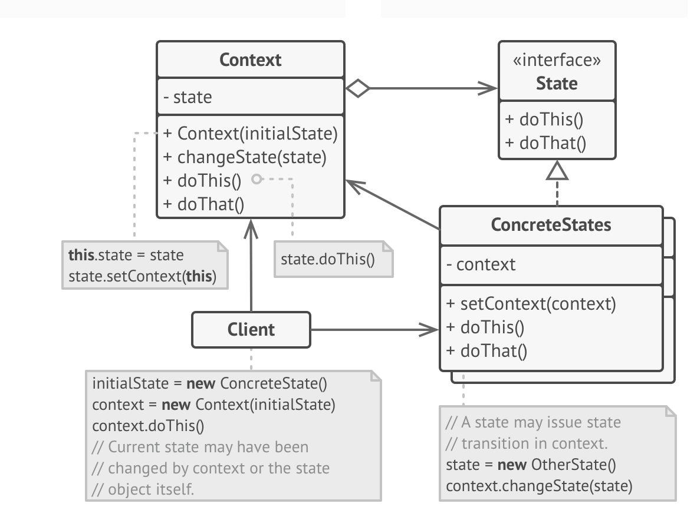

# State 模式




### 定义
**State:** is a behavioral design pattern that lets an object alter its behavior when its internal state changes. It appears as if the object changed its class.
允许一个对象在其内部状态改变时改变它的行为，对象看起来似乎修改了它的类。

### 参与者
#### Context  上下文
 Context stores  a reference to one of the concrete(具体的) state objects and delegates to it all  state-specific work. 
The context communicates with the state object via the state interface. The context exposes a setter for passing it  a new state object.
     
- 定义 Client 感兴趣的接口 
- 维护一个 ConcreteState 子类的实例，这个实例是当前的 state

#### State 状态
The state interface declares the state-specific method. These methods should make sense for all concrete states because you don’t want some of your states to have useless methods that will never be called.

-  定义接口以封装与 Context 的一个特定状态相关的行为. 

#### ConcreteState 具体状态类

Concrete state provide their own implementations for the state-specific methods.To avoid duplication of similar code across multiple states, you may provide intermediate abstract classes that encapsulate some common behavior.
         
State objects may store a reference to the context object. Through this reference, the state can fetch any required into from the context object, as well as initiate state transitions.
        
- each subclass implements a behavior associated with a state of the Context


### 协作
1. Context 将状态相关的请求委托给当前的 ConcreteState 对象处理
2. Context 可以将自身作为一个参数传递给 state, 让 state 可以访问到 Context
3. Context 是 client 使用的主要接口， 一般情况下 client 不需要直接与 state 打交道
4. Context 或 ConcreteState 子类都可以决定 next state, 以及设置转态转换的条件


### 适用性
1. 一个对象的行为取决于它的状态，并且必须在运行时刻根据状态改变它的行为
2. 一个操作中含有庞大的分支条件，并且这些分支依赖该对象的状态

### 实现过程
      
1. Decide what class will act as the context.
  
2. Declare the state interface.

3. For every actual state. create a  class that derives from the state interface.
      
4. In the context class, add a reference field of the state interface type and a public setter that allows overriding the value of that field.
     
5. Go over the method of the context again and replace empty state conditions with calls to corresponding method of the state object.
     
6. To switch the state fo the context, create an instance of one the state classes and
      pass it to the context. 


### State 模式与 Strategy 模式的不同点 
In the State pattern , the particular states may be aware of each other and initiate  transitions from one state to another, whereas strategies almost never know about know each other.


### 示例代码
#### 确定上下文

```java
/**
 * 上下文
 */
public class Context {

    // 定义状态
    public final static BaseState THIS_STATE = new ThisState();
    public final static BaseState THAT_STATE = new ThatState();

    // 当前状态
    private BaseState state;

    public void changeState(BaseState state){
        this.state = state;
        this.state.setContext(this);

    }

    public void doThis(){
        this.state.doThis();
    }

    public void doThat(){
        this.state.doThat();
    }
}
```

##### 确定 state 的接口或者抽象类

```java
public abstract class BaseState {

    protected Context context;

    public void setContext(Context context) {
        this.context = context;
    }

    public abstract void doThis();

    public abstract void doThat();
}
```

##### 实现具体的 State

```java
// ThisState.java
public class ThisState extends BaseState {
    
    @Override
    public void doThis() {
        System.out.println("ThisState doThis...");
    }
    @Override
    public void doThat() {
        System.out.println("ThisState doThis...");
    }
}

//  ThatState.java
public class ThatState extends BaseState {
    @Override
    public void doThis() {
        System.out.println("ThatState doThat...");
    }

    @Override
    public void doThat() {
        System.out.println("ThatState doThat...");
    }
}

```

##### Client

```java
public class Client {

    public static void main(String[] args){
        // 定义上下文
        Context context = new Context();
        // 设置初始状态
        context.changeState(Context.THIS_STATE);
        context.doThis();

        // 切换状态
        context.changeState(Context.THAT_STATE);
        context.doThat();
    }
}

```

