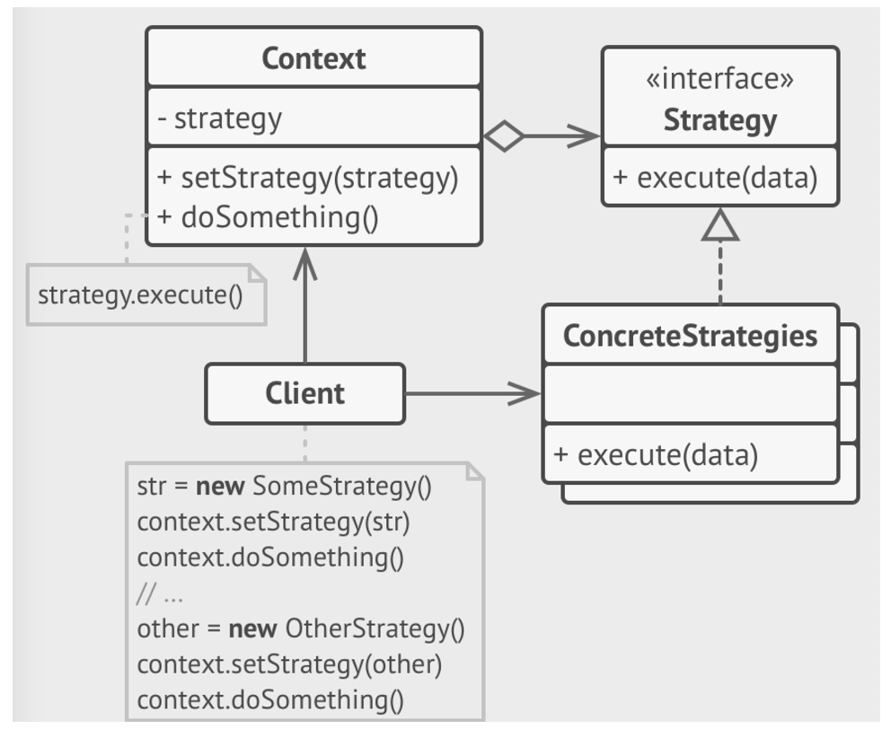

# Stratey 模式




### 定义
is a behavioral design pattern that lets you define a family of algorithms, pus each of them into a separate class,
and make their objects interchangeable.


### 参与者
#### Context  上下文
The context maintains a reference to one of the concrete strategies and communicates with this object only via the strategy interface.

* 用一个 ConcreteStrategy 对象来配置
* 维护一个对 Strategy 对象的引用
* 可定义一个接口来让 Strategy 访问它的数据


#### Strategy
The strategy interface is common to all concrete strategies. It declares a method the context uses to execute a strategy.
定义所有支持的算法的公共接口。 Context 使用这个接口来调用 ConcreteStrategy 定义的算法 

#### ConcreteStrategies 
Concrete Strategies  implement different variations of an algorithm the context uses.
以 Strategy 接口实现某具体算法

#### Client
The client creates a specific strategy object and passed it to the context . The context exposes a setter which lets clients replace the strategy associated with the context at runtime.


### 协作
Strategy 和 Context 相互作用以实现选定的算法。 当算法被调用时， Context 可以将算法所需要的所有数据都传递个该 Strategy.或者 Context 将自身传递给 Strategy

Context 将它的客户的请求转发给它的 Strategy. Client 通常创建并传递一个 ConcreteStrategy 对象给该 Context.


### 适用性
1. 一个对象的行为取决于它的状态，并且必须在运行时刻根据状态改变它的行为
2. 一个操作中含有庞大的分支条件，并且这些分支依赖该对象的状态

### 示例代码
#### 确定上下文

```java
/**
 * 上下文
 */
public class Context {

    // 定义状态
    public final static BaseState THIS_STATE = new ThisState();
    public final static BaseState THAT_STATE = new ThatState();

    // 当前状态
    private BaseState state;

    public void changeState(BaseState state){
        this.state = state;
        this.state.setContext(this);

    }

    public void doThis(){
        this.state.doThis();
    }

    public void doThat(){
        this.state.doThat();
    }
}
```

##### 确定 state 的接口或者抽象类

```java
public abstract class BaseState {

    protected Context context;

    public void setContext(Context context) {
        this.context = context;
    }

    public abstract void doThis();

    public abstract void doThat();
}
```

##### 实现具体的 State

```java
// ThisState.java
public class ThisState extends BaseState {
    
    @Override
    public void doThis() {
        System.out.println("ThisState doThis...");
    }
    @Override
    public void doThat() {
        System.out.println("ThisState doThis...");
    }
}

//  ThatState.java
public class ThatState extends BaseState {
    @Override
    public void doThis() {
        System.out.println("ThatState doThat...");
    }

    @Override
    public void doThat() {
        System.out.println("ThatState doThat...");
    }
}

```

##### Client

```java
public class Client {

    public static void main(String[] args){
        // 定义上下文
        Context context = new Context();
        // 设置初始状态
        context.changeState(Context.THIS_STATE);
        context.doThis();

        // 切换状态
        context.changeState(Context.THAT_STATE);
        context.doThat();
    }
}

```

