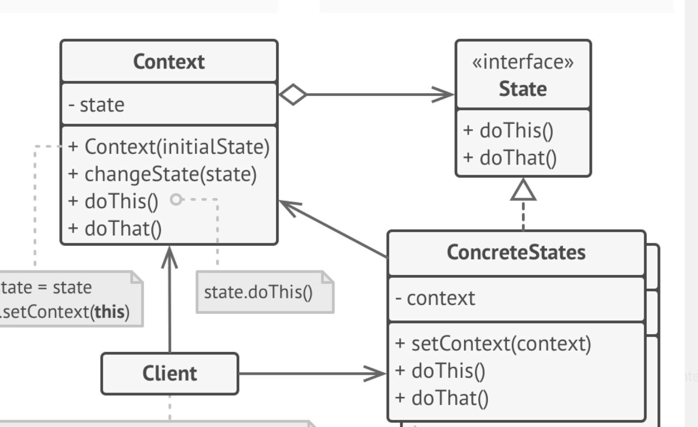

# 设计模式总结

以前学设计模式的时候，学地云里雾里的。最近把书本《设计模式-可复用面向对象软件的基础》重新学了一遍，收获良多，对设计模式有了更深的理解。

**设计模式是软件工程中一种通用的，可复用的一种解决方案，它是一种解决问题的通用模板。**

根据《设计模式》这本书的分类，设计模式分为三种

- 创建型
> 它是与对象的创建有关，包含 Abstract Factory, Builder, Factory Method, Prototype, Singleton 

- 结构型
> 处理类和对象的组合，包含 Apdater, Bridge, Composite, Decorator, Facade,
Flyweight, Proxy

- 行为型
> 对类或对象怎样交互和怎样分配职责进行描述， 包含 Chain of Responsibility, Command, Interpreter, Iterpreter, Iterator, Meadiator, Memento, Observer, State, Strategy, Templete method, Visitor

每种模式都对应着它的使用场景。

在熟知了设计模式之后，切不可为了模式而模式，对模式的滥用，陷入模式痴迷。模式痴迷是指对模式过于痴迷以至于无法不在代码中使用模式。要记得，我们使用设计模式是为了让代码更加简单。

当我们把设计模式的类图都过一遍，发现几乎所有的类图都是分成稳定部分和改变部分。稳定部分是用接口、抽象类或者父类来表示，改变部分则是由接口实现类或者子类表示。

> 例如上图是 State 模式的类图，稳定部分是 Context 和 state;改变部分是 ConcreteState

### 设计模式的目标
设计模式的目标就是管理变化，提高复用

### 设计模式的核心
**设计模式的核心是封装变化**

### 设计模式的原则
#### 依赖倒置原则
- 高层模块（稳定）不应该依赖于低层次模块（变化）， 二者都应该依赖于抽象（稳定）
- 抽象（稳定）不应该依赖于实现细节（变化），实现细节应依赖于抽象（稳定）

#### 开放封闭原则
- 对扩展开放，对更改封闭
- 类模块应该是可扩展的，但是不可修改

#### 单一职责原则
- 一个类应该仅有一个引起它变化的原因
- 变化的方向隐含着类的责任

#### 里氏替换原则
- 子类必须能够替换它们的基类
- 继承表达类型抽象

#### 接口隔离原则
- 不应该强迫客户程序依赖它们不用的方法
- 接口应该小而完备

#### 有限使用对象组合，而不是类继承
- 类继承通常为”白箱复用“， 对象组合通常为 ”黑箱复用“
- 继承在某种程度上破坏了封装性，子类父类耦合度高
- 对象组合只要求组合的对象具有良好定义的接口，耦合度低

#### 封装变化点
使用封装来创建对象的分界线。设计者可以在分界层的一侧修改，而不会对另一侧产生不良的影响，从而实现层次间的松耦合

#### 针对接口编程，而不是针对实现编程
- 不将变量类型声明为某个特定的具体类，而是声明为某个对象接口
- 客户程序无需获知对象的具体类型，只需知道对象具有的接口
- 减少系统中各个部分的依赖关系，从而实现”高内聚、低耦合“的类型设计方案

 
以上只是一般性的总结，那具体对应怎样使用设计模式呢

## 如何使用设计模式
除非是一些比较明显的地方，一般不使用采取大规模的预先设计，而是通过演进在重构过程中趋向模式的方式。
在重构的过程中对应下面的情况，可以选择相应的模式
### 选择相应的设计模式
在代码中出现的问题，选择相应的设计模式进行重构

#### 1.通过显式地指定一个类来创建对象
##### 问题：
通过显式地指定一个类来创建对象
##### 模式：
Abstract Factory, Factory Method, Prototype
##### 说明：
在创建对象时指定类名将使你受特定实现的约束而不是特定接口的约束。这会使未来的变化更复杂。要避免这种情况，应该间接地创建对象。

#### 2.对特殊操作的依赖

##### 问题：
对特殊操作的依赖
   
##### 模式：
Chain of Resposibility, Command
    
##### 说明：
当为请求指定一个特殊的操作时，完成该请求的方式就固定下来了。为避免把代码写死，可以在编译时刻或运行时刻很方便地改变响应请求的方法
  
#### 3.对硬件和软件平台的依赖
##### 问题
对硬件和软件平台的依赖

##### 模式
Abstract Factory, Bridge

##### 说明
外部的操作系统接口和应用编程接口（API）在不同的软硬件平台是不同的。依赖特定平台的软件将很难移植到其他平台上，甚至很难跟上本地平台的更新。所以设计系统时限制其平台相关性就很重要了。

#### 4.对对象表示或实现的依赖
##### 问题
对对象表示或实现的依赖
##### 模式
Abstract Factory, Bridge, Memonto, Proxy
##### 说明
知道对象怎样表示、保存、定位或实现的客户在对象发生变化时可能也需要变化。对客户隐藏这些信息能阻止连锁变化

#### 5.算法依赖
##### 问题
算法依赖
##### 模式
Builder, Iterator, Strategy, Template Method, Visitor
##### 说明
算法在开发和复用时常常被扩展、优化和替代。依赖于某个特定算法的对象在算法发生变化时不得不变化。因此有可能发生变化的算法应该被孤立起来。

#### 6.紧耦合
##### 问题
紧耦合
#### 模式
Abstract Factory, Commmand, Facade, Mediator, Observer, Chain of Responsibility

##### 说明
紧耦合的类很难独立地被复用，因为它们是相互依赖的。紧耦合产生单块的系统，要改变或删掉一个类，你必须理解和改变其他许多类。这样的系统是一个很难学习、移植和维护的密集体。
松散耦合提高了一个类本身被复用的可能性，并且系统更易于学习、移植、修改和扩展。设计模式使用抽象耦合和分层技术来提供系统的松散耦合醒。

#### 7. 通过子类来扩充功能
##### 问题
通过子类扩充功能
##### 模式
Bridge, Chain of Responsibility, Composite, Decorator, Observer, Strategy
##### 说明
通常很难通过子类来定制对象。每一个新类都有固定的实现开销。定义子类还需要对父类有深入的了解。一个被重定义的操作可能需要调用继承下来的操作。并且子类方法会导致类爆炸，因为即使对一个简单的扩充。不等不引入许多子类。
一般的对象组合技术和具体的委托技术，是继承之外组合对象行为的另一种灵活方式。新的功能可以通过新的方式组合已有对象，而不是通过定义已存在类的子类的方式加到应用中去。

#### 8.不能方便地对类进行修改
##### 问题
不能方便地对类进行修改
##### 模式
Adapter, Decorator, Visitor
##### 说明
有时不地不改变一个难以修改的类，需要源代码而又没有（第三方库），或者可能对类的任何改变会要求修改许多已存在的其他子类。

### 怎样使用设计模式
过程
#### 1.大致浏览一遍模式
特别注意其适用性部分和效果部分，确定它适合你的问题

#### 2.回头研究结构部分、参与者部分和协作部分
确保你理解这个模式的类和对象以及它们是怎样关联的

#### 3.看代码示例部分，看看这个模式代码形式的具体例子
研究代码将有助于你实现模式

#### 4.选择模式参与者名字，使它们在应用上下文中有意义
设计模式参与者的名字通常过于抽象而不会直接出现在应用中.然而，将参与者的名字和应用中出现的名字合并起来是很有用的。这会帮助你在实现中更显示的体验出模式来。 
例如使用了 State 模式
> BaseDialogState

#### 5.定义类
生命它们的接口，建立它们的继承关系，定义代表数据和对象引用的实例变量。识别模式会影响到你应用中存在的类，做出相应的修改

#### 6.定义模式中专用于应用的操作名称
名字一般依赖于应用。使用与每一个操作相关联的责任和协作作为指导

#### 7.实现执行模式中责任和协作的操作
实现部分提供线索指导你进行实现。代码示例部分的例子也能提供帮助。

## 其他
《设计模式》是一本很经典的书，每隔一两年可以拿出来再读一遍，也总会有巨大的收获

## 参考
- 《设计模式-可复用面向对象软件的基础》，GoF
- 《设计模式之禅》, 秦少波
- 《重构与模式（Refactoring to Patterns）》, Joshua Kerievsky

