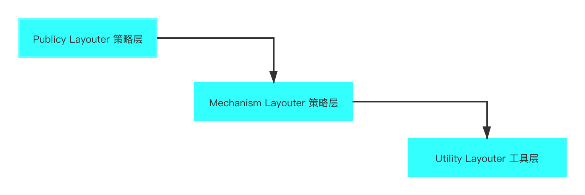
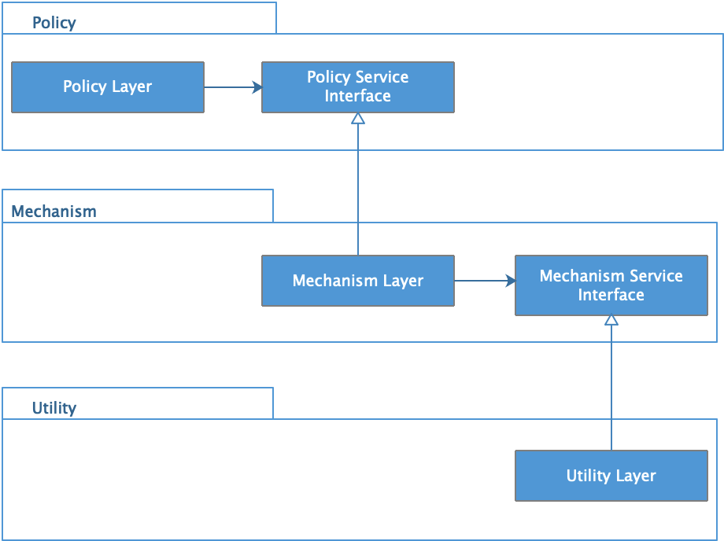
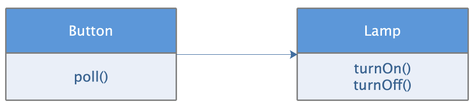
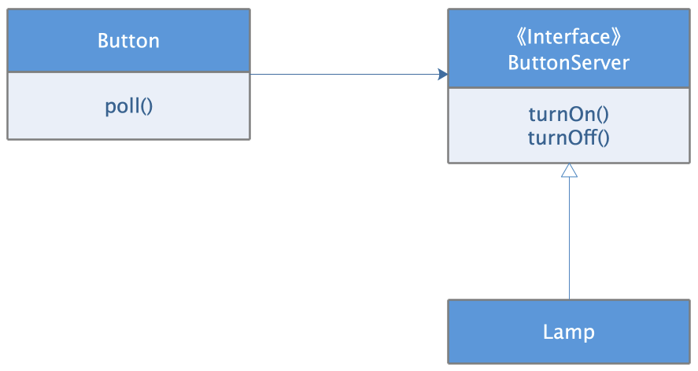
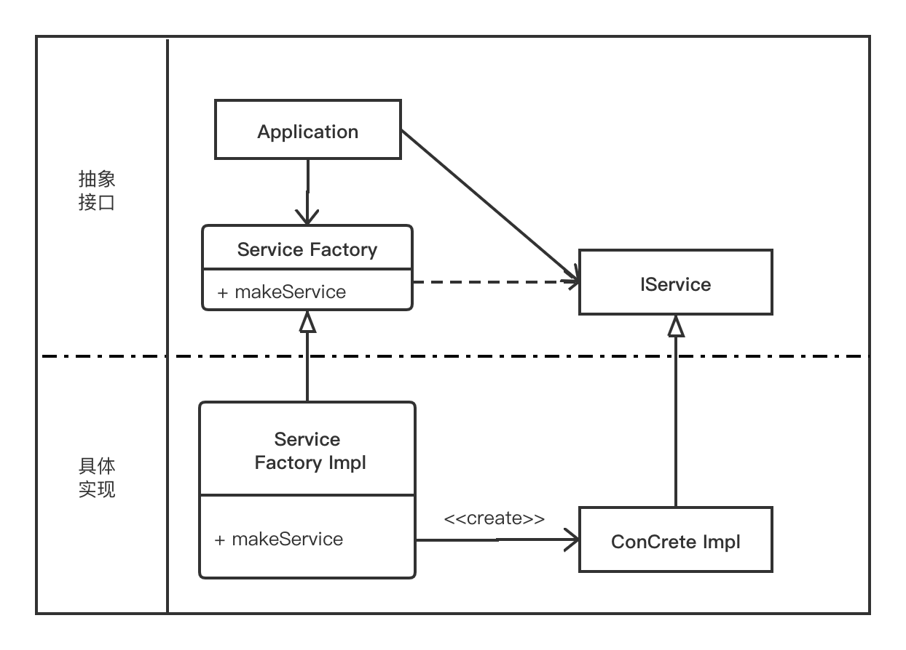

# 软件设计原则（一）： 依赖倒置原则

> 如何不依赖代码却可以复用它的功能

在软件设计中为了建立清晰的软件分层关系，引入了软件分层设计，也是便于高层业务模块依赖低层模块。在一般的应用软件中，策略层会依赖方法层，业务逻辑层会依赖数据存储层。

图1

这是我们正常的软件设计。

但是这样的设计会带来一些问题。

策略层对方程层和工具层是传递依赖的，如果下面两层的改动，都会对策略层产生影响，这样导致的级联改动非常不利用软件的维护。

出现了上述问题，可能会想到定义策略层和工具层的接口，毕竟接口比实现更问题。

所以，会变成下面的设计关系。

图2

Policy layer 层依赖的是方法层的 MechanismService 接口，而方法层会依赖工具层的 UtilityService 接口。这是通常的编程习惯，底层模块有自己的接口，高层模块依赖低层模块提供的接口。

但是我们下面不是用这种方式，而是用依赖倒置设计原则去重构。

###依赖倒置的设计原则

按照依赖倒置原则，接口的所有权是被倒置的，也就是说，接口被定义在高层模块，高层模块拥有接口，低层模块实现接口。不是高层模块依赖低层模块的接口，而是低层模块依赖高层模块的接口，从而实现依赖关系的倒置。

图3

在上面的依赖层次中，每一层的接口都被高层模块定义，由低层模块实现，高层模块完全不依赖底层模块。这样低层模块的改动不会影响高层模块，高层模块的复用也不会完全依赖低层模块。

### 使用依赖倒置实现高层模块复用

依赖倒置原则也适用于一个类向另一个类发送消息的场景

Button 控制灯泡，按钮按下的时候，灯泡点亮或关闭。常规的设计是，Button 类直接依赖 Lamp 灯泡类

图4

这样会导致问题，Button 依赖 Lamp, Lamp 的任何改动都会牵扯到 Button, 变成联级的改动。另外，如果想要 Button 控制另外一种电器，Button 变难以重用， 以为 Button 依赖着 Lamp.

解决办法是将依赖中的具体实现，改成为依赖抽象。

重构后的设计

图5

抽象接口 ButtonServer 是属于高层模块 Button 的，不属于低层模块 Lamp。这样就形成了依赖倒置。

Button 不会再依赖 Lamp，而是依赖抽象的 ButtonServer, 而 Lamp 是
ButtonServer 的具体实现，这样 Lamp 的改动基本上就不会牵扯 Button。另外，如果想要重用 Button 控制其他设备, 只需要这些设备实现 ButtonServer 接口即可。

### 抽象工厂模式
在创建对象是，一般都会是具体实现，这样就会形成一个依赖。这时，可以选择用抽象工厂模式来解决代码依赖的问题。

图6

Application 通过调用 ServiceFactory接口的 makeService 方法。这个方法由 ServiceFactoryImpl 类具体提供，该方法初始化一个 ConcreteImpl 类的实例，并且将其返回 Service 类型返回。

图6中间的虚线代表着软件架构中的抽象层与具体实现层的边界。所有跨越这条边界源码级别的依赖关系都应该是单向的，即具体实现层依赖抽象层。

抽象接口层包含了应用的所有高阶业务规则，具体实现层则包括了这些业务规则需要做的具体操作及其相关的细节信息。

图6中控制流跨越边界（虚线）的方向与源代码依赖关系跨越该边界的反向相反，源代码依赖用于是控制流方向反向，这就是依赖倒置。

### 依赖导致原则
- 高层次的模块不应该依赖于低层次的模块，两者都应该依赖于抽象接口
- 抽象接口不应该依赖于具体实现，而具体实现则应该依赖于抽象接口

高层：业务逻辑
底层：UI,底层配置（数据库等）

高层模块不依赖低层模块，而是依赖抽象接口，这个接口是由高层模块定义，低层模块实现

应用规则：

- 1. 应用代码多使用抽象接口，尽量避免使用多变的具体实现类
- 2. 不要继承具体类，除非是抽象类
- 3. 不要重写 override, 包含具体实现的函数

### 参考
- [《架构整洁之道》](https://book.douban.com/subject/30333919/)第11章：DIP 依赖反转原则
- [极客时间-李智慧·后端技术面试38讲](https://time.geekbang.org/column/article/179282)  12 | 软件设计的依赖倒置原则：如何不依赖代码却可以复用它的功能

